# Introduction

DDSAnalytics is an analytics company that specializes in talent management solutions for Fortune 100 companies. Talent management is defined as the iterative process of developing and retaining employees. It may include workforce planning, employee training programs, identifying high-potential employees and reducing/preventing voluntary employee turnover (attrition). To gain a competitive edge over its competition, DDSAnalytics is planning to leverage data science for talent management. The executive leadership has identified predicting employee turnover as its first application of data science for talent management. Before the business green lights the project, they have tasked us to conduct an analysis of existing employee data. This R markdown does detailed statistical analysis of the given datasets and contains code,plots and all hypothesis test with conclusion. It also contains code and its output that was written to build predictive model as requested by talent management firm. 

Along with this R code, we also built an app to perform EDA and interactive plots. We have posted this app on the web. <br>

Please visit the app on this link <br>
<font color="Blue">
https://sachinac.shinyapps.io/msds_rshiny_cs02/
</font>

# Data Description

Dataset contains record of 870 employees and 36 different attributes that can be utitlized to find pattern of attrition and to build a model to predict attrition.
Data is clean and our initial investigation found nothing suspicious. For more details please keep reading following sections.


## Load data


```r
msds_cs02_ds <- read.csv('../data/CaseStudy2-data.csv',header=TRUE)
```

## Original Structure


```r
str(msds_cs02_ds)
```

```
## 'data.frame':	870 obs. of  36 variables:
##  $ ID                      : int  1 2 3 4 5 6 7 8 9 10 ...
##  $ Age                     : int  32 40 35 32 24 27 41 37 34 34 ...
##  $ Attrition               : Factor w/ 2 levels "No","Yes": 1 1 1 1 1 1 1 1 1 1 ...
##  $ BusinessTravel          : Factor w/ 3 levels "Non-Travel","Travel_Frequently",..: 3 3 2 3 2 2 3 3 3 2 ...
##  $ DailyRate               : int  117 1308 200 801 567 294 1283 309 1333 653 ...
##  $ Department              : Factor w/ 3 levels "Human Resources",..: 3 2 2 3 2 2 2 3 3 2 ...
##  $ DistanceFromHome        : int  13 14 18 1 2 10 5 10 10 10 ...
##  $ Education               : int  4 3 2 4 1 2 5 4 4 4 ...
##  $ EducationField          : Factor w/ 6 levels "Human Resources",..: 2 4 2 3 6 2 4 2 2 6 ...
##  $ EmployeeCount           : int  1 1 1 1 1 1 1 1 1 1 ...
##  $ EmployeeNumber          : int  859 1128 1412 2016 1646 733 1448 1105 1055 1597 ...
##  $ EnvironmentSatisfaction : int  2 3 3 3 1 4 2 4 3 4 ...
##  $ Gender                  : Factor w/ 2 levels "Female","Male": 2 2 2 1 1 2 2 1 1 2 ...
##  $ HourlyRate              : int  73 44 60 48 32 32 90 88 87 92 ...
##  $ JobInvolvement          : int  3 2 3 3 3 3 4 2 3 2 ...
##  $ JobLevel                : int  2 5 3 3 1 3 1 2 1 2 ...
##  $ JobRole                 : Factor w/ 9 levels "Healthcare Representative",..: 8 6 5 8 7 5 7 8 9 1 ...
##  $ JobSatisfaction         : int  4 3 4 4 4 1 3 4 3 3 ...
##  $ MaritalStatus           : Factor w/ 3 levels "Divorced","Married",..: 1 3 3 2 3 1 2 1 2 2 ...
##  $ MonthlyIncome           : int  4403 19626 9362 10422 3760 8793 2127 6694 2220 5063 ...
##  $ MonthlyRate             : int  9250 17544 19944 24032 17218 4809 5561 24223 18410 15332 ...
##  $ NumCompaniesWorked      : int  2 1 2 1 1 1 2 2 1 1 ...
##  $ Over18                  : Factor w/ 1 level "Y": 1 1 1 1 1 1 1 1 1 1 ...
##  $ OverTime                : Factor w/ 2 levels "No","Yes": 1 1 1 1 2 1 2 2 2 1 ...
##  $ PercentSalaryHike       : int  11 14 11 19 13 21 12 14 19 14 ...
##  $ PerformanceRating       : int  3 3 3 3 3 4 3 3 3 3 ...
##  $ RelationshipSatisfaction: int  3 1 3 3 3 3 1 3 4 2 ...
##  $ StandardHours           : int  80 80 80 80 80 80 80 80 80 80 ...
##  $ StockOptionLevel        : int  1 0 0 2 0 2 0 3 1 1 ...
##  $ TotalWorkingYears       : int  8 21 10 14 6 9 7 8 1 8 ...
##  $ TrainingTimesLastYear   : int  3 2 2 3 2 4 5 5 2 3 ...
##  $ WorkLifeBalance         : int  2 4 3 3 3 2 2 3 3 2 ...
##  $ YearsAtCompany          : int  5 20 2 14 6 9 4 1 1 8 ...
##  $ YearsInCurrentRole      : int  2 7 2 10 3 7 2 0 1 2 ...
##  $ YearsSinceLastPromotion : int  0 4 2 5 1 1 0 0 0 7 ...
##  $ YearsWithCurrManager    : int  3 9 2 7 3 7 3 0 0 7 ...
```

## Data fields and Types

Let's take a closer look at structure of the dataset

We can categorized fields as follows:


* **Non Predictors** 
  + ID 
  + EmployeeNumber
  + EmployeeCount
  + StandardHours
  + Over18<br>  

* **Nominal Categorical Predictors :**  
  + BusinessTravel
  + Department
  + EducationField
  + Gender
  + JobRole
  + MaritalStatus
  + OverTime<br>  

* **Ordinal Categorical Predictors :**
  + Education
  + EnvironmentSatisfaction
  + JobInvolvement
  + JobLevel
  + JobSatisfaction
  + PerformanceRating
  + RelationshipSatisfaction
  + StockOptionLevel
  + WorkLifeBalance<br>  

* **Numerical Predictors :**  
  + Age
  + DailyRate
  + DistanceFromHome
  + HourlyRate
  + MonthlyIncome
  + MonthlyRate
  + NumCompaniesWorked
  + PercentSalaryHike
  + TotalWorkingYears
  + TrainingTimesLastYear
  + YearsAtCompany
  + YearsInCurrentRole
  + YearsSinceLastPromotion
  + YearsWithCurrManager<br>  

* **Response Variable :**  
  + Attrition (for classification model)
  + MonthlyIncome (for regression model) <br>  

<font size=4>
<b>  
Nominal predictors are numeric fields in the dataset. However, we should change it to factors to treat them as categorical variables.
</b>
</font>


```r
msds_cs02_ds$Education                <- as.factor(msds_cs02_ds$Education)
msds_cs02_ds$EnvironmentSatisfaction  <- as.factor(msds_cs02_ds$EnvironmentSatisfaction)
msds_cs02_ds$JobInvolvement           <- as.factor(msds_cs02_ds$JobInvolvement)      
msds_cs02_ds$JobLevel                 <- as.factor(msds_cs02_ds$JobLevel)
msds_cs02_ds$JobSatisfaction          <- as.factor(msds_cs02_ds$JobSatisfaction) 
msds_cs02_ds$PerformanceRating        <- as.factor(msds_cs02_ds$PerformanceRating)
msds_cs02_ds$RelationshipSatisfaction <- as.factor(msds_cs02_ds$RelationshipSatisfaction)
msds_cs02_ds$StockOptionLevel         <- as.factor(msds_cs02_ds$StockOptionLevel) 
msds_cs02_ds$WorkLifeBalance          <- as.factor(msds_cs02_ds$WorkLifeBalance)
```

## Final Structure

<b>
  Final structure to continue with analysis
</b>


```r
str(msds_cs02_ds)
```

```
## 'data.frame':	870 obs. of  36 variables:
##  $ ID                      : int  1 2 3 4 5 6 7 8 9 10 ...
##  $ Age                     : int  32 40 35 32 24 27 41 37 34 34 ...
##  $ Attrition               : Factor w/ 2 levels "No","Yes": 1 1 1 1 1 1 1 1 1 1 ...
##  $ BusinessTravel          : Factor w/ 3 levels "Non-Travel","Travel_Frequently",..: 3 3 2 3 2 2 3 3 3 2 ...
##  $ DailyRate               : int  117 1308 200 801 567 294 1283 309 1333 653 ...
##  $ Department              : Factor w/ 3 levels "Human Resources",..: 3 2 2 3 2 2 2 3 3 2 ...
##  $ DistanceFromHome        : int  13 14 18 1 2 10 5 10 10 10 ...
##  $ Education               : Factor w/ 5 levels "1","2","3","4",..: 4 3 2 4 1 2 5 4 4 4 ...
##  $ EducationField          : Factor w/ 6 levels "Human Resources",..: 2 4 2 3 6 2 4 2 2 6 ...
##  $ EmployeeCount           : int  1 1 1 1 1 1 1 1 1 1 ...
##  $ EmployeeNumber          : int  859 1128 1412 2016 1646 733 1448 1105 1055 1597 ...
##  $ EnvironmentSatisfaction : Factor w/ 4 levels "1","2","3","4": 2 3 3 3 1 4 2 4 3 4 ...
##  $ Gender                  : Factor w/ 2 levels "Female","Male": 2 2 2 1 1 2 2 1 1 2 ...
##  $ HourlyRate              : int  73 44 60 48 32 32 90 88 87 92 ...
##  $ JobInvolvement          : Factor w/ 4 levels "1","2","3","4": 3 2 3 3 3 3 4 2 3 2 ...
##  $ JobLevel                : Factor w/ 5 levels "1","2","3","4",..: 2 5 3 3 1 3 1 2 1 2 ...
##  $ JobRole                 : Factor w/ 9 levels "Healthcare Representative",..: 8 6 5 8 7 5 7 8 9 1 ...
##  $ JobSatisfaction         : Factor w/ 4 levels "1","2","3","4": 4 3 4 4 4 1 3 4 3 3 ...
##  $ MaritalStatus           : Factor w/ 3 levels "Divorced","Married",..: 1 3 3 2 3 1 2 1 2 2 ...
##  $ MonthlyIncome           : int  4403 19626 9362 10422 3760 8793 2127 6694 2220 5063 ...
##  $ MonthlyRate             : int  9250 17544 19944 24032 17218 4809 5561 24223 18410 15332 ...
##  $ NumCompaniesWorked      : int  2 1 2 1 1 1 2 2 1 1 ...
##  $ Over18                  : Factor w/ 1 level "Y": 1 1 1 1 1 1 1 1 1 1 ...
##  $ OverTime                : Factor w/ 2 levels "No","Yes": 1 1 1 1 2 1 2 2 2 1 ...
##  $ PercentSalaryHike       : int  11 14 11 19 13 21 12 14 19 14 ...
##  $ PerformanceRating       : Factor w/ 2 levels "3","4": 1 1 1 1 1 2 1 1 1 1 ...
##  $ RelationshipSatisfaction: Factor w/ 4 levels "1","2","3","4": 3 1 3 3 3 3 1 3 4 2 ...
##  $ StandardHours           : int  80 80 80 80 80 80 80 80 80 80 ...
##  $ StockOptionLevel        : Factor w/ 4 levels "0","1","2","3": 2 1 1 3 1 3 1 4 2 2 ...
##  $ TotalWorkingYears       : int  8 21 10 14 6 9 7 8 1 8 ...
##  $ TrainingTimesLastYear   : int  3 2 2 3 2 4 5 5 2 3 ...
##  $ WorkLifeBalance         : Factor w/ 4 levels "1","2","3","4": 2 4 3 3 3 2 2 3 3 2 ...
##  $ YearsAtCompany          : int  5 20 2 14 6 9 4 1 1 8 ...
##  $ YearsInCurrentRole      : int  2 7 2 10 3 7 2 0 1 2 ...
##  $ YearsSinceLastPromotion : int  0 4 2 5 1 1 0 0 0 7 ...
##  $ YearsWithCurrManager    : int  3 9 2 7 3 7 3 0 0 7 ...
```

```r
# Create list for different types of variables for later use

non_predictors <- c('ID','EmployeeNumber','EmployeeCount','StandardHours','Over18')
  
nom_qual_predictors <- c('BusinessTravel','Department','EducationField',
                         'Gender','JobRole','MaritalStatus','OverTime')
  
ord_qual_predictors <- c('Education','EnvironmentSatisfaction','JobInvolvement','JobLevel',
                         'JobSatisfaction','PerformanceRating','RelationshipSatisfaction',
                         'StockOptionLevel','WorkLifeBalance')

num_predictors <- c('Age','DailyRate','DistanceFromHome','HourlyRate',
                    'MonthlyRate','NumCompaniesWorked','PercentSalaryHike','TotalWorkingYears',
                    'TrainingTimesLastYear','YearsAtCompany','YearsInCurrentRole',
                    'YearsSinceLastPromotion','YearsWithCurrManager') 
```


# Explore the data

Lets start to get some basic insights from the dataset.

## Total Employees
<font size=4>
Number of employees per Department. As clearly seen from the pie chart R & D is the major department for **DDS Analytics** followed by Sales and HR.
</font>


```r
  df <- sqldf("select Department,count(*) employee_count from msds_cs02_ds group by  Department")
  df
```

<div data-pagedtable="false">
  <script data-pagedtable-source type="application/json">
{"columns":[{"label":["Department"],"name":[1],"type":["fctr"],"align":["left"]},{"label":["employee_count"],"name":[2],"type":["int"],"align":["right"]}],"data":[{"1":"Human Resources","2":"35"},{"1":"Research & Development","2":"562"},{"1":"Sales","2":"273"}],"options":{"columns":{"min":{},"max":[10]},"rows":{"min":[10],"max":[10]},"pages":{}}}
  </script>
</div>

```r
  p  <- plot_ly(df, labels = ~Department, values = ~employee_count, type = 'pie') %>%
                 layout(title = 'Number of employees per Department',
                 xaxis = list(showgrid = FALSE, zeroline = FALSE, showticklabels = FALSE),
                 yaxis = list(showgrid = FALSE, zeroline = FALSE, showticklabels = FALSE))
  p
```

<!--html_preserve--><div id="htmlwidget-23719b744b333708d39e" style="width:672px;height:480px;" class="plotly html-widget"></div>
<script type="application/json" data-for="htmlwidget-23719b744b333708d39e">{"x":{"visdat":{"d09851e2e22b":["function () ","plotlyVisDat"]},"cur_data":"d09851e2e22b","attrs":{"d09851e2e22b":{"labels":{},"values":{},"alpha_stroke":1,"sizes":[10,100],"spans":[1,20],"type":"pie"}},"layout":{"margin":{"b":40,"l":60,"t":25,"r":10},"title":"Number of employees per Department","xaxis":{"showgrid":false,"zeroline":false,"showticklabels":false},"yaxis":{"showgrid":false,"zeroline":false,"showticklabels":false},"hovermode":"closest","showlegend":true},"source":"A","config":{"showSendToCloud":false},"data":[{"labels":["Human Resources","Research & Development","Sales"],"values":[35,562,273],"type":"pie","marker":{"color":"rgba(31,119,180,1)","line":{"color":"rgba(255,255,255,1)"}},"frame":null}],"highlight":{"on":"plotly_click","persistent":false,"dynamic":false,"selectize":false,"opacityDim":0.2,"selected":{"opacity":1},"debounce":0},"shinyEvents":["plotly_hover","plotly_click","plotly_selected","plotly_relayout","plotly_brushed","plotly_brushing","plotly_clickannotation","plotly_doubleclick","plotly_deselect","plotly_afterplot"],"base_url":"https://plot.ly"},"evals":[],"jsHooks":[]}</script><!--/html_preserve-->

## Mean Age

<font size=4>
 Mean age of the organization is 37 <br>
 Median age of the organization is 35 <br>
 Mean Age of attrition 33 <br>
 Median Age of attrtion is 32
</font>


```r
  age_Attrition     <- msds_cs02_ds %>% filter(Attrition=='Yes') %>% select(Age)
  age_non_attrition <- msds_cs02_ds %>% filter(Attrition=='No') %>% select(Age)
  

p <- plot_ly(alpha = 0.6) %>%
     add_histogram(x = ~age_non_attrition$Age+1) %>%
     add_histogram(x = ~age_Attrition$Age) %>%
     layout(title = 'Histogram',
     barmode = "overlay",showlegend = F,xaxis = list(title = "Attrition(Yellow) and No Attrition (Blue)"))
       
p
```

<!--html_preserve--><div id="htmlwidget-41b1095796fb8062d897" style="width:672px;height:480px;" class="plotly html-widget"></div>
<script type="application/json" data-for="htmlwidget-41b1095796fb8062d897">{"x":{"visdat":{"d09826beed3d":["function () ","plotlyVisDat"]},"cur_data":"d09826beed3d","attrs":{"d09826beed3d":{"alpha":0.6,"alpha_stroke":1,"sizes":[10,100],"spans":[1,20],"x":{},"type":"histogram","inherit":true},"d09826beed3d.1":{"alpha":0.6,"alpha_stroke":1,"sizes":[10,100],"spans":[1,20],"x":{},"type":"histogram","inherit":true}},"layout":{"margin":{"b":40,"l":60,"t":25,"r":10},"title":"Histogram","barmode":"overlay","showlegend":false,"xaxis":{"domain":[0,1],"automargin":true,"title":"Attrition(Yellow) and No Attrition (Blue)"},"yaxis":{"domain":[0,1],"automargin":true},"hovermode":"closest"},"source":"A","config":{"showSendToCloud":false},"data":[{"x":[33,41,36,33,25,28,42,38,35,35,44,29,36,31,47,32,33,47,35,45,37,49,44,32,34,45,39,53,33,34,47,36,33,33,57,32,59,46,50,43,24,43,39,28,39,59,45,46,32,42,30,38,37,32,19,33,36,24,36,38,42,29,42,31,35,47,46,32,36,39,38,37,60,48,28,47,39,36,51,43,47,38,30,35,28,32,35,24,54,27,30,56,33,29,53,53,36,36,38,26,30,42,35,37,22,46,39,30,36,46,44,47,30,50,43,40,44,41,55,38,57,59,47,38,41,30,34,34,25,29,33,33,42,35,31,41,44,43,31,34,43,36,50,34,53,30,31,48,47,34,54,22,33,39,36,39,44,40,40,29,26,48,51,29,31,32,47,49,27,52,52,50,45,25,33,33,33,45,31,42,42,43,38,43,28,41,39,49,31,27,35,34,29,39,31,36,23,25,50,46,36,55,44,43,33,26,51,43,46,30,30,30,32,33,42,42,34,37,46,41,44,32,31,35,26,30,25,36,35,34,31,46,35,28,37,56,57,23,44,56,44,42,41,32,39,34,35,37,36,46,37,28,48,41,36,35,33,36,56,36,25,51,35,56,26,35,41,52,61,48,35,25,40,20,33,35,31,47,40,28,45,43,39,43,50,28,60,36,35,28,37,29,34,31,31,40,35,27,45,57,43,32,41,41,42,35,27,33,37,53,41,56,57,35,41,24,33,32,31,46,38,21,51,43,30,48,27,49,24,39,36,30,37,35,27,32,61,43,32,47,57,45,31,43,48,37,36,44,32,37,54,44,37,42,38,33,36,31,37,38,30,35,38,19,29,44,31,22,35,28,41,30,41,28,27,39,33,30,45,47,48,39,43,39,46,34,45,34,49,41,32,52,57,37,43,37,51,32,39,37,37,54,28,46,46,29,47,38,27,53,38,30,32,35,57,32,35,50,51,30,36,37,52,46,38,37,40,30,48,33,52,38,39,40,33,34,22,52,43,31,35,46,50,60,54,46,32,36,39,37,30,33,44,39,43,43,31,34,28,39,35,35,50,41,39,46,42,29,37,49,41,38,55,35,43,27,37,59,28,32,31,45,33,43,51,42,29,35,27,38,39,45,40,30,26,43,39,29,45,41,39,38,36,23,50,41,34,36,41,28,25,33,31,30,54,60,39,27,34,36,42,31,35,34,45,40,36,48,35,36,28,25,39,56,35,56,35,39,37,44,36,43,35,25,31,41,56,41,27,36,36,61,41,49,27,52,55,42,37,33,35,47,36,35,30,30,55,38,34,29,28,47,37,41,37,32,26,44,37,58,29,32,34,39,39,43,38,48,49,37,47,30,35,36,60,42,55,32,39,51,31,58,49,37,37,31,29,29,38,38,35,37,43,26,38,35,23,44,35,28,40,60,36,36,26,32,38,24,26,25,35,25,34,51,55,45,36,50,39,48,42,51,35,46,42,41,47,46,34,47,40,43,24,31,33,27,40,34,34,48,32,52,56,26,50,35,39,37,50,46,37,34,32,40,45,37,26,23,31,28,31,26,25,48,39,34,31,34,31,33,30,35,37,47,35,39,51,46,29,20,56,38,38,35,48,49,30,53,35,35,29,20,40,27,31,30,29,36,36,32,42,52,44,48,46,49,33,48,46,36],"type":"histogram","marker":{"color":"rgba(31,119,180,0.6)","line":{"color":"rgba(31,119,180,1)"}},"error_y":{"color":"rgba(31,119,180,0.6)"},"error_x":{"color":"rgba(31,119,180,0.6)"},"xaxis":"x","yaxis":"y","frame":null},{"x":[33,53,35,36,32,18,42,25,36,24,35,52,37,35,29,37,46,32,29,39,31,39,28,20,55,26,40,28,43,38,45,47,37,25,31,31,29,33,32,25,22,34,31,28,58,31,32,44,33,50,29,29,52,36,30,51,21,34,34,31,32,49,28,50,28,35,43,26,29,58,41,30,48,58,28,48,33,41,25,56,28,56,29,24,30,21,36,34,28,24,29,33,19,20,28,27,34,41,18,40,22,33,32,35,29,19,47,30,18,26,24,35,26,39,27,32,29,20,31,46,45,29,36,29,41,52,33,22,19,35,28,31,31,19,18,40,31,30,44,34],"type":"histogram","marker":{"color":"rgba(255,127,14,0.6)","line":{"color":"rgba(255,127,14,1)"}},"error_y":{"color":"rgba(255,127,14,0.6)"},"error_x":{"color":"rgba(255,127,14,0.6)"},"xaxis":"x","yaxis":"y","frame":null}],"highlight":{"on":"plotly_click","persistent":false,"dynamic":false,"selectize":false,"opacityDim":0.2,"selected":{"opacity":1},"debounce":0},"shinyEvents":["plotly_hover","plotly_click","plotly_selected","plotly_relayout","plotly_brushed","plotly_brushing","plotly_clickannotation","plotly_doubleclick","plotly_deselect","plotly_afterplot"],"base_url":"https://plot.ly"},"evals":[],"jsHooks":[]}</script><!--/html_preserve-->

```r
mean(msds_cs02_ds$Age)
```

```
## [1] 36.82874
```

```r
median(msds_cs02_ds$Age)
```

```
## [1] 35
```

```r
mean(age_Attrition$Age)
```

```
## [1] 33.78571
```

```r
median(age_Attrition$Age)
```

```
## [1] 32
```


## Attrition

let's analyze Attrition from the dataset

### Attrition Rate

Total Employees     - 870<br>
Employees Attrition - 140


```r
   df <- sqldf("select Attrition,count(*) Attrition_count from msds_cs02_ds group by  Attrition")
   df
```

<div data-pagedtable="false">
  <script data-pagedtable-source type="application/json">
{"columns":[{"label":["Attrition"],"name":[1],"type":["fctr"],"align":["left"]},{"label":["Attrition_count"],"name":[2],"type":["int"],"align":["right"]}],"data":[{"1":"No","2":"730"},{"1":"Yes","2":"140"}],"options":{"columns":{"min":{},"max":[10]},"rows":{"min":[10],"max":[10]},"pages":{}}}
  </script>
</div>

```r
   p  <- plot_ly(df, labels = ~Attrition, values = ~Attrition_count, type = 'pie') %>%
                 layout(title = 'Attrition Rate',
                 xaxis = list(showgrid = FALSE, zeroline = FALSE, showticklabels = FALSE),
                 yaxis = list(showgrid = FALSE, zeroline = FALSE, showticklabels = FALSE))
   p
```

<!--html_preserve--><div id="htmlwidget-b9c690df2afa25181571" style="width:672px;height:480px;" class="plotly html-widget"></div>
<script type="application/json" data-for="htmlwidget-b9c690df2afa25181571">{"x":{"visdat":{"d09859dc8ea5":["function () ","plotlyVisDat"]},"cur_data":"d09859dc8ea5","attrs":{"d09859dc8ea5":{"labels":{},"values":{},"alpha_stroke":1,"sizes":[10,100],"spans":[1,20],"type":"pie"}},"layout":{"margin":{"b":40,"l":60,"t":25,"r":10},"title":"Attrition Rate","xaxis":{"showgrid":false,"zeroline":false,"showticklabels":false},"yaxis":{"showgrid":false,"zeroline":false,"showticklabels":false},"hovermode":"closest","showlegend":true},"source":"A","config":{"showSendToCloud":false},"data":[{"labels":["No","Yes"],"values":[730,140],"type":"pie","marker":{"color":"rgba(31,119,180,1)","line":{"color":"rgba(255,255,255,1)"}},"frame":null}],"highlight":{"on":"plotly_click","persistent":false,"dynamic":false,"selectize":false,"opacityDim":0.2,"selected":{"opacity":1},"debounce":0},"shinyEvents":["plotly_hover","plotly_click","plotly_selected","plotly_relayout","plotly_brushed","plotly_brushing","plotly_clickannotation","plotly_doubleclick","plotly_deselect","plotly_afterplot"],"base_url":"https://plot.ly"},"evals":[],"jsHooks":[]}</script><!--/html_preserve-->

### Age

<font size=4>

Below plot shows agewise attrition pattern from the data. Attrition is higher for the age range - 18-30 and 55+

</font>


```r
spineplot(Attrition~ Age, data = msds_cs02_ds)
```

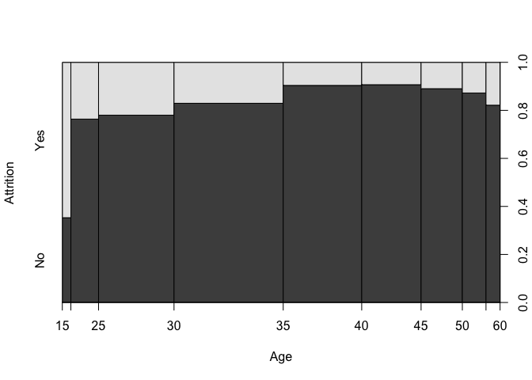<!-- -->

### Department
 
* As shown in pie chart 
  + Sales department is the highest contributor to attrition (21.6%) 59 out of  273 employees
  + Research and Development is the second highest with 13.3%. i.e. 75 out of 562 employees
  + HR has only 6 in headcount 


```r
df_RandD <- sqldf("select Attrition,count(*) Attrition_count from msds_cs02_ds  where Department like 'Research%' group by  Attrition")
df_RandD
```

<div data-pagedtable="false">
  <script data-pagedtable-source type="application/json">
{"columns":[{"label":["Attrition"],"name":[1],"type":["fctr"],"align":["left"]},{"label":["Attrition_count"],"name":[2],"type":["int"],"align":["right"]}],"data":[{"1":"No","2":"487"},{"1":"Yes","2":"75"}],"options":{"columns":{"min":{},"max":[10]},"rows":{"min":[10],"max":[10]},"pages":{}}}
  </script>
</div>

```r
df_Sales <- sqldf("select Attrition,count(*) Attrition_count from msds_cs02_ds  where Department like 'Sales%' group by  Attrition")
df_Sales
```

<div data-pagedtable="false">
  <script data-pagedtable-source type="application/json">
{"columns":[{"label":["Attrition"],"name":[1],"type":["fctr"],"align":["left"]},{"label":["Attrition_count"],"name":[2],"type":["int"],"align":["right"]}],"data":[{"1":"No","2":"214"},{"1":"Yes","2":"59"}],"options":{"columns":{"min":{},"max":[10]},"rows":{"min":[10],"max":[10]},"pages":{}}}
  </script>
</div>

```r
df_hr    <- sqldf("select Attrition,count(*) Attrition_count from msds_cs02_ds  where Department like 'Human%' group by  Attrition")
df_hr
```

<div data-pagedtable="false">
  <script data-pagedtable-source type="application/json">
{"columns":[{"label":["Attrition"],"name":[1],"type":["fctr"],"align":["left"]},{"label":["Attrition_count"],"name":[2],"type":["int"],"align":["right"]}],"data":[{"1":"No","2":"29"},{"1":"Yes","2":"6"}],"options":{"columns":{"min":{},"max":[10]},"rows":{"min":[10],"max":[10]},"pages":{}}}
  </script>
</div>

```r
p <- plot_ly() %>%
  add_pie(data = df_RandD ,labels = ~Attrition, values = ~Attrition_count,
          title = "Research & Development", domain = list(x = c(0, 0.4), y = c(0.4, 1))) %>%
  add_pie(data = df_Sales, labels = ~Attrition, values = ~Attrition_count,
          title = "Sales", domain = list(x = c(0.6, 1), y = c(0.4, 1))) %>%
  add_pie(data = df_hr, labels = ~Attrition, values = ~Attrition_count,
          title = "Human Resource", domain = list(x = c(0.25, 0.75), y = c(0, 0.6))) %>%
  layout(title = "Departmentwise Attrition", showlegend = T,
         xaxis = list(showgrid = FALSE, zeroline = FALSE, showticklabels = FALSE),
         yaxis = list(showgrid = FALSE, zeroline = FALSE, showticklabels = FALSE))
   
p
```

<!--html_preserve--><div id="htmlwidget-8238c88d29fd535eedf4" style="width:672px;height:480px;" class="plotly html-widget"></div>
<script type="application/json" data-for="htmlwidget-8238c88d29fd535eedf4">{"x":{"visdat":{"d0987d53020a":["function () ","plotlyVisDat"],"d09854ab1ecd":["function () ","data"],"d0982e735028":["function () ","data"],"d098149389eb":["function () ","data"]},"cur_data":"d098149389eb","attrs":{"d09854ab1ecd":{"alpha_stroke":1,"sizes":[10,100],"spans":[1,20],"values":{},"labels":{},"type":"pie","title":"Research & Development","domain":{"x":[0,0.4],"y":[0.4,1]},"inherit":true},"d0982e735028":{"alpha_stroke":1,"sizes":[10,100],"spans":[1,20],"values":{},"labels":{},"type":"pie","title":"Sales","domain":{"x":[0.6,1],"y":[0.4,1]},"inherit":true},"d098149389eb":{"alpha_stroke":1,"sizes":[10,100],"spans":[1,20],"values":{},"labels":{},"type":"pie","title":"Human Resource","domain":{"x":[0.25,0.75],"y":[0,0.6]},"inherit":true}},"layout":{"margin":{"b":40,"l":60,"t":25,"r":10},"title":"Departmentwise Attrition","showlegend":true,"xaxis":{"showgrid":false,"zeroline":false,"showticklabels":false},"yaxis":{"showgrid":false,"zeroline":false,"showticklabels":false},"hovermode":"closest"},"source":"A","config":{"showSendToCloud":false},"data":[{"values":[487,75],"labels":["No","Yes"],"type":"pie","title":"Research & Development","domain":{"x":[0,0.4],"y":[0.4,1]},"marker":{"color":"rgba(31,119,180,1)","line":{"color":"rgba(255,255,255,1)"}},"frame":null},{"values":[214,59],"labels":["No","Yes"],"type":"pie","title":"Sales","domain":{"x":[0.6,1],"y":[0.4,1]},"marker":{"color":"rgba(255,127,14,1)","line":{"color":"rgba(255,255,255,1)"}},"frame":null},{"values":[29,6],"labels":["No","Yes"],"type":"pie","title":"Human Resource","domain":{"x":[0.25,0.75],"y":[0,0.6]},"marker":{"color":"rgba(44,160,44,1)","line":{"color":"rgba(255,255,255,1)"}},"frame":null}],"highlight":{"on":"plotly_click","persistent":false,"dynamic":false,"selectize":false,"opacityDim":0.2,"selected":{"opacity":1},"debounce":0},"shinyEvents":["plotly_hover","plotly_click","plotly_selected","plotly_relayout","plotly_brushed","plotly_brushing","plotly_clickannotation","plotly_doubleclick","plotly_deselect","plotly_afterplot"],"base_url":"https://plot.ly"},"evals":[],"jsHooks":[]}</script><!--/html_preserve-->


### JobRole and Department

This plot shows attrition by job role by taking department into account <r>

<b>Following Jobroles are the topmost contributors to attrition</b>

<ul>
  <li>Sales Executives 33 </li>
  <li>Research Scientist 32</li>
  <li>Labortory Technicians 30</li>
  <li>Sales Representative 24</li>
</ul>  


```r
df <- sqldf("select Department,JobRole,count(*) Attrition_count from msds_cs02_ds  where Attrition='Yes' group by  Department,JobRole order by Attrition_count desc")

p <- ggplotly(ggplot(data=df, aes(x=Department, y=Attrition_count, fill=JobRole)) +
     geom_bar(stat="identity", position=position_dodge())+
     geom_text(aes(label=Attrition_count),vjust = 2.1,position=position_dodge(width=0.8))+
     theme_bw()+
     theme(axis.text.x = element_text(angle=45, vjust=0.6)))

p
```

<!--html_preserve--><div id="htmlwidget-25b48622c5930d6e96d7" style="width:672px;height:480px;" class="plotly html-widget"></div>
<script type="application/json" data-for="htmlwidget-25b48622c5930d6e96d7">{"x":{"data":[{"orientation":"v","width":0.15,"base":0,"x":[1.625],"y":[8],"text":"Department: Research & Development<br />Attrition_count:  8<br />JobRole: Healthcare Representative","type":"bar","marker":{"autocolorscale":false,"color":"rgba(248,118,109,1)","line":{"width":1.88976377952756,"color":"transparent"}},"name":"Healthcare Representative","legendgroup":"Healthcare Representative","showlegend":true,"xaxis":"x","yaxis":"y","hoverinfo":"text","frame":null},{"orientation":"v","width":0.9,"base":0,"x":[1],"y":[6],"text":"Department: Human Resources<br />Attrition_count:  6<br />JobRole: Human Resources","type":"bar","marker":{"autocolorscale":false,"color":"rgba(211,146,0,1)","line":{"width":1.88976377952756,"color":"transparent"}},"name":"Human Resources","legendgroup":"Human Resources","showlegend":true,"xaxis":"x","yaxis":"y","hoverinfo":"text","frame":null},{"orientation":"v","width":0.15,"base":0,"x":[1.775],"y":[30],"text":"Department: Research & Development<br />Attrition_count: 30<br />JobRole: Laboratory Technician","type":"bar","marker":{"autocolorscale":false,"color":"rgba(147,170,0,1)","line":{"width":1.88976377952756,"color":"transparent"}},"name":"Laboratory Technician","legendgroup":"Laboratory Technician","showlegend":true,"xaxis":"x","yaxis":"y","hoverinfo":"text","frame":null},{"orientation":"v","width":[0.15,0.3],"base":[0,0],"x":[1.925,2.7],"y":[2,2],"text":["Department: Research & Development<br />Attrition_count:  2<br />JobRole: Manager","Department: Sales<br />Attrition_count:  2<br />JobRole: Manager"],"type":"bar","marker":{"autocolorscale":false,"color":"rgba(0,186,56,1)","line":{"width":1.88976377952756,"color":"transparent"}},"name":"Manager","legendgroup":"Manager","showlegend":true,"xaxis":"x","yaxis":"y","hoverinfo":"text","frame":null},{"orientation":"v","width":0.15,"base":0,"x":[2.075],"y":[2],"text":"Department: Research & Development<br />Attrition_count:  2<br />JobRole: Manufacturing Director","type":"bar","marker":{"autocolorscale":false,"color":"rgba(0,193,159,1)","line":{"width":1.88976377952756,"color":"transparent"}},"name":"Manufacturing Director","legendgroup":"Manufacturing Director","showlegend":true,"xaxis":"x","yaxis":"y","hoverinfo":"text","frame":null},{"orientation":"v","width":0.15,"base":0,"x":[2.225],"y":[1],"text":"Department: Research & Development<br />Attrition_count:  1<br />JobRole: Research Director","type":"bar","marker":{"autocolorscale":false,"color":"rgba(0,185,227,1)","line":{"width":1.88976377952756,"color":"transparent"}},"name":"Research Director","legendgroup":"Research Director","showlegend":true,"xaxis":"x","yaxis":"y","hoverinfo":"text","frame":null},{"orientation":"v","width":0.15,"base":0,"x":[2.375],"y":[32],"text":"Department: Research & Development<br />Attrition_count: 32<br />JobRole: Research Scientist","type":"bar","marker":{"autocolorscale":false,"color":"rgba(97,156,255,1)","line":{"width":1.88976377952756,"color":"transparent"}},"name":"Research Scientist","legendgroup":"Research Scientist","showlegend":true,"xaxis":"x","yaxis":"y","hoverinfo":"text","frame":null},{"orientation":"v","width":0.3,"base":0,"x":[3],"y":[33],"text":"Department: Sales<br />Attrition_count: 33<br />JobRole: Sales Executive","type":"bar","marker":{"autocolorscale":false,"color":"rgba(219,114,251,1)","line":{"width":1.88976377952756,"color":"transparent"}},"name":"Sales Executive","legendgroup":"Sales Executive","showlegend":true,"xaxis":"x","yaxis":"y","hoverinfo":"text","frame":null},{"orientation":"v","width":0.3,"base":0,"x":[3.3],"y":[24],"text":"Department: Sales<br />Attrition_count: 24<br />JobRole: Sales Representative","type":"bar","marker":{"autocolorscale":false,"color":"rgba(255,97,195,1)","line":{"width":1.88976377952756,"color":"transparent"}},"name":"Sales Representative","legendgroup":"Sales Representative","showlegend":true,"xaxis":"x","yaxis":"y","hoverinfo":"text","frame":null},{"x":[1.66666666666667],"y":[8],"text":8,"hovertext":"Attrition_count:  8<br />Department: Research & Development<br />Attrition_count:  8<br />JobRole: Healthcare Representative","textfont":{"size":14.6645669291339,"color":"rgba(0,0,0,1)"},"type":"scatter","mode":"text","hoveron":"points","name":"Healthcare Representative","legendgroup":"Healthcare Representative","showlegend":false,"xaxis":"x","yaxis":"y","hoverinfo":"text","frame":null},{"x":[1],"y":[6],"text":6,"hovertext":"Attrition_count:  6<br />Department: Human Resources<br />Attrition_count:  6<br />JobRole: Human Resources","textfont":{"size":14.6645669291339,"color":"rgba(0,0,0,1)"},"type":"scatter","mode":"text","hoveron":"points","name":"Human Resources","legendgroup":"Human Resources","showlegend":false,"xaxis":"x","yaxis":"y","hoverinfo":"text","frame":null},{"x":[1.8],"y":[30],"text":30,"hovertext":"Attrition_count: 30<br />Department: Research & Development<br />Attrition_count: 30<br />JobRole: Laboratory Technician","textfont":{"size":14.6645669291339,"color":"rgba(0,0,0,1)"},"type":"scatter","mode":"text","hoveron":"points","name":"Laboratory Technician","legendgroup":"Laboratory Technician","showlegend":false,"xaxis":"x","yaxis":"y","hoverinfo":"text","frame":null},{"x":[1.93333333333333,2.73333333333333],"y":[2,2],"text":[2,2],"hovertext":["Attrition_count:  2<br />Department: Research & Development<br />Attrition_count:  2<br />JobRole: Manager","Attrition_count:  2<br />Department: Sales<br />Attrition_count:  2<br />JobRole: Manager"],"textfont":{"size":14.6645669291339,"color":"rgba(0,0,0,1)"},"type":"scatter","mode":"text","hoveron":"points","name":"Manager","legendgroup":"Manager","showlegend":false,"xaxis":"x","yaxis":"y","hoverinfo":"text","frame":null},{"x":[2.06666666666667],"y":[2],"text":2,"hovertext":"Attrition_count:  2<br />Department: Research & Development<br />Attrition_count:  2<br />JobRole: Manufacturing Director","textfont":{"size":14.6645669291339,"color":"rgba(0,0,0,1)"},"type":"scatter","mode":"text","hoveron":"points","name":"Manufacturing Director","legendgroup":"Manufacturing Director","showlegend":false,"xaxis":"x","yaxis":"y","hoverinfo":"text","frame":null},{"x":[2.2],"y":[1],"text":1,"hovertext":"Attrition_count:  1<br />Department: Research & Development<br />Attrition_count:  1<br />JobRole: Research Director","textfont":{"size":14.6645669291339,"color":"rgba(0,0,0,1)"},"type":"scatter","mode":"text","hoveron":"points","name":"Research Director","legendgroup":"Research Director","showlegend":false,"xaxis":"x","yaxis":"y","hoverinfo":"text","frame":null},{"x":[2.33333333333333],"y":[32],"text":32,"hovertext":"Attrition_count: 32<br />Department: Research & Development<br />Attrition_count: 32<br />JobRole: Research Scientist","textfont":{"size":14.6645669291339,"color":"rgba(0,0,0,1)"},"type":"scatter","mode":"text","hoveron":"points","name":"Research Scientist","legendgroup":"Research Scientist","showlegend":false,"xaxis":"x","yaxis":"y","hoverinfo":"text","frame":null},{"x":[3],"y":[33],"text":33,"hovertext":"Attrition_count: 33<br />Department: Sales<br />Attrition_count: 33<br />JobRole: Sales Executive","textfont":{"size":14.6645669291339,"color":"rgba(0,0,0,1)"},"type":"scatter","mode":"text","hoveron":"points","name":"Sales Executive","legendgroup":"Sales Executive","showlegend":false,"xaxis":"x","yaxis":"y","hoverinfo":"text","frame":null},{"x":[3.26666666666667],"y":[24],"text":24,"hovertext":"Attrition_count: 24<br />Department: Sales<br />Attrition_count: 24<br />JobRole: Sales Representative","textfont":{"size":14.6645669291339,"color":"rgba(0,0,0,1)"},"type":"scatter","mode":"text","hoveron":"points","name":"Sales Representative","legendgroup":"Sales Representative","showlegend":false,"xaxis":"x","yaxis":"y","hoverinfo":"text","frame":null}],"layout":{"margin":{"t":26.2283105022831,"r":7.30593607305936,"b":96.3199534379092,"l":37.2602739726027},"plot_bgcolor":"rgba(255,255,255,1)","paper_bgcolor":"rgba(255,255,255,1)","font":{"color":"rgba(0,0,0,1)","family":"","size":14.6118721461187},"xaxis":{"domain":[0,1],"automargin":true,"type":"linear","autorange":false,"range":[0.4,3.6],"tickmode":"array","ticktext":["Human Resources","Research & Development","Sales"],"tickvals":[1,2,3],"categoryorder":"array","categoryarray":["Human Resources","Research & Development","Sales"],"nticks":null,"ticks":"outside","tickcolor":"rgba(51,51,51,1)","ticklen":3.65296803652968,"tickwidth":0.66417600664176,"showticklabels":true,"tickfont":{"color":"rgba(77,77,77,1)","family":"","size":11.689497716895},"tickangle":-45,"showline":false,"linecolor":null,"linewidth":0,"showgrid":true,"gridcolor":"rgba(235,235,235,1)","gridwidth":0.66417600664176,"zeroline":false,"anchor":"y","title":{"text":"Department","font":{"color":"rgba(0,0,0,1)","family":"","size":14.6118721461187}},"hoverformat":".2f"},"yaxis":{"domain":[0,1],"automargin":true,"type":"linear","autorange":false,"range":[-1.65,34.65],"tickmode":"array","ticktext":["0","10","20","30"],"tickvals":[0,10,20,30],"categoryorder":"array","categoryarray":["0","10","20","30"],"nticks":null,"ticks":"outside","tickcolor":"rgba(51,51,51,1)","ticklen":3.65296803652968,"tickwidth":0.66417600664176,"showticklabels":true,"tickfont":{"color":"rgba(77,77,77,1)","family":"","size":11.689497716895},"tickangle":-0,"showline":false,"linecolor":null,"linewidth":0,"showgrid":true,"gridcolor":"rgba(235,235,235,1)","gridwidth":0.66417600664176,"zeroline":false,"anchor":"x","title":{"text":"Attrition_count","font":{"color":"rgba(0,0,0,1)","family":"","size":14.6118721461187}},"hoverformat":".2f"},"shapes":[{"type":"rect","fillcolor":"transparent","line":{"color":"rgba(51,51,51,1)","width":0.66417600664176,"linetype":"solid"},"yref":"paper","xref":"paper","x0":0,"x1":1,"y0":0,"y1":1}],"showlegend":true,"legend":{"bgcolor":"rgba(255,255,255,1)","bordercolor":"transparent","borderwidth":1.88976377952756,"font":{"color":"rgba(0,0,0,1)","family":"","size":11.689497716895},"y":0.913385826771654},"annotations":[{"text":"JobRole","x":1.02,"y":1,"showarrow":false,"ax":0,"ay":0,"font":{"color":"rgba(0,0,0,1)","family":"","size":14.6118721461187},"xref":"paper","yref":"paper","textangle":-0,"xanchor":"left","yanchor":"bottom","legendTitle":true}],"hovermode":"closest","barmode":"relative"},"config":{"doubleClick":"reset","showSendToCloud":false},"source":"A","attrs":{"d098796b0c63":{"x":{},"y":{},"fill":{},"type":"bar"},"d09862fa75db":{"label":{},"x":{},"y":{},"fill":{}}},"cur_data":"d098796b0c63","visdat":{"d098796b0c63":["function (y) ","x"],"d09862fa75db":["function (y) ","x"]},"highlight":{"on":"plotly_click","persistent":false,"dynamic":false,"selectize":false,"opacityDim":0.2,"selected":{"opacity":1},"debounce":0},"shinyEvents":["plotly_hover","plotly_click","plotly_selected","plotly_relayout","plotly_brushed","plotly_brushing","plotly_clickannotation","plotly_doubleclick","plotly_deselect","plotly_afterplot"],"base_url":"https://plot.ly"},"evals":[],"jsHooks":[]}</script><!--/html_preserve-->


### JobRole only

This plot shows attrition by job role without taking department into account <r>
<b> Topmost Jobroles that contributes to attrition</b>

<ul>
  <li>Sales Executives (23.6%) </li>
  <li>Research Scientist (22.9%) </li>
  <li>Labortory Technicians (21.4%)</li>
  <li>Sales Representative (21.4%)</li>
</ul>  


```r
df <- sqldf("select JobRole,count(*) Attrition_count from msds_cs02_ds  where Attrition='Yes' group by  JobRole order by Attrition_count desc")

p <- df %>%
     plot_ly(labels = ~JobRole, values = ~Attrition_count) %>%
     add_pie(hole = 0.6) %>%
     layout(title = "Attrition by Job Role",  showlegend = T,
         xaxis = list(showgrid = FALSE, zeroline = FALSE, showticklabels = FALSE),
         yaxis = list(showgrid = FALSE, zeroline = FALSE, showticklabels = FALSE))
p
```

<!--html_preserve--><div id="htmlwidget-c9f62c245ed9e7805d93" style="width:672px;height:480px;" class="plotly html-widget"></div>
<script type="application/json" data-for="htmlwidget-c9f62c245ed9e7805d93">{"x":{"visdat":{"d0983d15e69a":["function () ","plotlyVisDat"]},"cur_data":"d0983d15e69a","attrs":{"d0983d15e69a":{"labels":{},"values":{},"alpha_stroke":1,"sizes":[10,100],"spans":[1,20],"type":"pie","hole":0.6,"inherit":true}},"layout":{"margin":{"b":40,"l":60,"t":25,"r":10},"title":"Attrition by Job Role","showlegend":true,"xaxis":{"showgrid":false,"zeroline":false,"showticklabels":false},"yaxis":{"showgrid":false,"zeroline":false,"showticklabels":false},"hovermode":"closest"},"source":"A","config":{"showSendToCloud":false},"data":[{"labels":["Sales Executive","Research Scientist","Laboratory Technician","Sales Representative","Healthcare Representative","Human Resources","Manager","Manufacturing Director","Research Director"],"values":[33,32,30,24,8,6,4,2,1],"type":"pie","hole":0.6,"marker":{"color":"rgba(31,119,180,1)","line":{"color":"rgba(255,255,255,1)"}},"frame":null}],"highlight":{"on":"plotly_click","persistent":false,"dynamic":false,"selectize":false,"opacityDim":0.2,"selected":{"opacity":1},"debounce":0},"shinyEvents":["plotly_hover","plotly_click","plotly_selected","plotly_relayout","plotly_brushed","plotly_brushing","plotly_clickannotation","plotly_doubleclick","plotly_deselect","plotly_afterplot"],"base_url":"https://plot.ly"},"evals":[],"jsHooks":[]}</script><!--/html_preserve-->

### Gender


```r
count(msds_cs02_ds,Gender)
```

<div data-pagedtable="false">
  <script data-pagedtable-source type="application/json">
{"columns":[{"label":["Gender"],"name":[1],"type":["fctr"],"align":["left"]},{"label":["n"],"name":[2],"type":["int"],"align":["right"]}],"data":[{"1":"Female","2":"354"},{"1":"Male","2":"516"}],"options":{"columns":{"min":{},"max":[10]},"rows":{"min":[10],"max":[10]},"pages":{}}}
  </script>
</div>

```r
df <- sqldf("select Department,Gender,count(*) Attrition_count from msds_cs02_ds  where Attrition='Yes' group by  Department,Gender order by Attrition_count desc")
df
```

<div data-pagedtable="false">
  <script data-pagedtable-source type="application/json">
{"columns":[{"label":["Department"],"name":[1],"type":["fctr"],"align":["left"]},{"label":["Gender"],"name":[2],"type":["fctr"],"align":["left"]},{"label":["Attrition_count"],"name":[3],"type":["int"],"align":["right"]}],"data":[{"1":"Research & Development","2":"Male","3":"50"},{"1":"Sales","2":"Male","3":"34"},{"1":"Research & Development","2":"Female","3":"25"},{"1":"Sales","2":"Female","3":"25"},{"1":"Human Resources","2":"Female","3":"3"},{"1":"Human Resources","2":"Male","3":"3"}],"options":{"columns":{"min":{},"max":[10]},"rows":{"min":[10],"max":[10]},"pages":{}}}
  </script>
</div>

```r
p <- ggplotly(ggplot(data=df, aes(x=Department, y=Attrition_count, fill=Gender)) +
     geom_bar(stat="identity", position=position_dodge())+
     geom_text(aes(label=Attrition_count),vjust = 2.1,position=position_dodge(width=0.5))+
     theme_bw()+
     theme(axis.text.x = element_text(angle=45, vjust=0.5)))

p
```

<!--html_preserve--><div id="htmlwidget-01eb95eb1f8fc1554cfd" style="width:672px;height:480px;" class="plotly html-widget"></div>
<script type="application/json" data-for="htmlwidget-01eb95eb1f8fc1554cfd">{"x":{"data":[{"orientation":"v","width":[0.45,0.45,0.45],"base":[0,0,0],"x":[0.775,1.775,2.775],"y":[3,25,25],"text":["Department: Human Resources<br />Attrition_count:  3<br />Gender: Female","Department: Research & Development<br />Attrition_count: 25<br />Gender: Female","Department: Sales<br />Attrition_count: 25<br />Gender: Female"],"type":"bar","marker":{"autocolorscale":false,"color":"rgba(248,118,109,1)","line":{"width":1.88976377952756,"color":"transparent"}},"name":"Female","legendgroup":"Female","showlegend":true,"xaxis":"x","yaxis":"y","hoverinfo":"text","frame":null},{"orientation":"v","width":[0.45,0.45,0.45],"base":[0,0,0],"x":[1.225,2.225,3.225],"y":[3,50,34],"text":["Department: Human Resources<br />Attrition_count:  3<br />Gender: Male","Department: Research & Development<br />Attrition_count: 50<br />Gender: Male","Department: Sales<br />Attrition_count: 34<br />Gender: Male"],"type":"bar","marker":{"autocolorscale":false,"color":"rgba(0,191,196,1)","line":{"width":1.88976377952756,"color":"transparent"}},"name":"Male","legendgroup":"Male","showlegend":true,"xaxis":"x","yaxis":"y","hoverinfo":"text","frame":null},{"x":[0.875,1.875,2.875],"y":[3,25,25],"text":[3,25,25],"hovertext":["Attrition_count:  3<br />Department: Human Resources<br />Attrition_count:  3<br />Gender: Female","Attrition_count: 25<br />Department: Research & Development<br />Attrition_count: 25<br />Gender: Female","Attrition_count: 25<br />Department: Sales<br />Attrition_count: 25<br />Gender: Female"],"textfont":{"size":14.6645669291339,"color":"rgba(0,0,0,1)"},"type":"scatter","mode":"text","hoveron":"points","name":"Female","legendgroup":"Female","showlegend":false,"xaxis":"x","yaxis":"y","hoverinfo":"text","frame":null},{"x":[1.125,2.125,3.125],"y":[3,50,34],"text":[3,50,34],"hovertext":["Attrition_count:  3<br />Department: Human Resources<br />Attrition_count:  3<br />Gender: Male","Attrition_count: 50<br />Department: Research & Development<br />Attrition_count: 50<br />Gender: Male","Attrition_count: 34<br />Department: Sales<br />Attrition_count: 34<br />Gender: Male"],"textfont":{"size":14.6645669291339,"color":"rgba(0,0,0,1)"},"type":"scatter","mode":"text","hoveron":"points","name":"Male","legendgroup":"Male","showlegend":false,"xaxis":"x","yaxis":"y","hoverinfo":"text","frame":null}],"layout":{"margin":{"t":26.2283105022831,"r":7.30593607305936,"b":96.3199534379092,"l":37.2602739726027},"plot_bgcolor":"rgba(255,255,255,1)","paper_bgcolor":"rgba(255,255,255,1)","font":{"color":"rgba(0,0,0,1)","family":"","size":14.6118721461187},"xaxis":{"domain":[0,1],"automargin":true,"type":"linear","autorange":false,"range":[0.4,3.6],"tickmode":"array","ticktext":["Human Resources","Research & Development","Sales"],"tickvals":[1,2,3],"categoryorder":"array","categoryarray":["Human Resources","Research & Development","Sales"],"nticks":null,"ticks":"outside","tickcolor":"rgba(51,51,51,1)","ticklen":3.65296803652968,"tickwidth":0.66417600664176,"showticklabels":true,"tickfont":{"color":"rgba(77,77,77,1)","family":"","size":11.689497716895},"tickangle":-45,"showline":false,"linecolor":null,"linewidth":0,"showgrid":true,"gridcolor":"rgba(235,235,235,1)","gridwidth":0.66417600664176,"zeroline":false,"anchor":"y","title":{"text":"Department","font":{"color":"rgba(0,0,0,1)","family":"","size":14.6118721461187}},"hoverformat":".2f"},"yaxis":{"domain":[0,1],"automargin":true,"type":"linear","autorange":false,"range":[-2.5,52.5],"tickmode":"array","ticktext":["0","10","20","30","40","50"],"tickvals":[0,10,20,30,40,50],"categoryorder":"array","categoryarray":["0","10","20","30","40","50"],"nticks":null,"ticks":"outside","tickcolor":"rgba(51,51,51,1)","ticklen":3.65296803652968,"tickwidth":0.66417600664176,"showticklabels":true,"tickfont":{"color":"rgba(77,77,77,1)","family":"","size":11.689497716895},"tickangle":-0,"showline":false,"linecolor":null,"linewidth":0,"showgrid":true,"gridcolor":"rgba(235,235,235,1)","gridwidth":0.66417600664176,"zeroline":false,"anchor":"x","title":{"text":"Attrition_count","font":{"color":"rgba(0,0,0,1)","family":"","size":14.6118721461187}},"hoverformat":".2f"},"shapes":[{"type":"rect","fillcolor":"transparent","line":{"color":"rgba(51,51,51,1)","width":0.66417600664176,"linetype":"solid"},"yref":"paper","xref":"paper","x0":0,"x1":1,"y0":0,"y1":1}],"showlegend":true,"legend":{"bgcolor":"rgba(255,255,255,1)","bordercolor":"transparent","borderwidth":1.88976377952756,"font":{"color":"rgba(0,0,0,1)","family":"","size":11.689497716895},"y":0.913385826771654},"annotations":[{"text":"Gender","x":1.02,"y":1,"showarrow":false,"ax":0,"ay":0,"font":{"color":"rgba(0,0,0,1)","family":"","size":14.6118721461187},"xref":"paper","yref":"paper","textangle":-0,"xanchor":"left","yanchor":"bottom","legendTitle":true}],"hovermode":"closest","barmode":"relative"},"config":{"doubleClick":"reset","showSendToCloud":false},"source":"A","attrs":{"d098e103baf":{"x":{},"y":{},"fill":{},"type":"bar"},"d0984bbe655f":{"label":{},"x":{},"y":{},"fill":{}}},"cur_data":"d098e103baf","visdat":{"d098e103baf":["function (y) ","x"],"d0984bbe655f":["function (y) ","x"]},"highlight":{"on":"plotly_click","persistent":false,"dynamic":false,"selectize":false,"opacityDim":0.2,"selected":{"opacity":1},"debounce":0},"shinyEvents":["plotly_hover","plotly_click","plotly_selected","plotly_relayout","plotly_brushed","plotly_brushing","plotly_clickannotation","plotly_doubleclick","plotly_deselect","plotly_afterplot"],"base_url":"https://plot.ly"},"evals":[],"jsHooks":[]}</script><!--/html_preserve-->

```r
df <- sqldf("select Gender,count(*) Attrition_count from msds_cs02_ds  where Attrition='Yes' group by Gender order by Attrition_count ")
df
```

<div data-pagedtable="false">
  <script data-pagedtable-source type="application/json">
{"columns":[{"label":["Gender"],"name":[1],"type":["fctr"],"align":["left"]},{"label":["Attrition_count"],"name":[2],"type":["int"],"align":["right"]}],"data":[{"1":"Female","2":"53"},{"1":"Male","2":"87"}],"options":{"columns":{"min":{},"max":[10]},"rows":{"min":[10],"max":[10]},"pages":{}}}
  </script>
</div>

```r
p  <- plot_ly(df, labels = ~Gender, values = ~Attrition_count, type = 'pie') %>%
                  layout(title = 'Genderwise Attrition',
                  xaxis = list(showgrid = FALSE, zeroline = FALSE, showticklabels = FALSE),
                  yaxis = list(showgrid = FALSE, zeroline = FALSE, showticklabels = FALSE))

p
```

<!--html_preserve--><div id="htmlwidget-077aa1604ef43298a1e6" style="width:672px;height:480px;" class="plotly html-widget"></div>
<script type="application/json" data-for="htmlwidget-077aa1604ef43298a1e6">{"x":{"visdat":{"d0982ee57df3":["function () ","plotlyVisDat"]},"cur_data":"d0982ee57df3","attrs":{"d0982ee57df3":{"labels":{},"values":{},"alpha_stroke":1,"sizes":[10,100],"spans":[1,20],"type":"pie"}},"layout":{"margin":{"b":40,"l":60,"t":25,"r":10},"title":"Genderwise Attrition","xaxis":{"showgrid":false,"zeroline":false,"showticklabels":false},"yaxis":{"showgrid":false,"zeroline":false,"showticklabels":false},"hovermode":"closest","showlegend":true},"source":"A","config":{"showSendToCloud":false},"data":[{"labels":["Female","Male"],"values":[53,87],"type":"pie","marker":{"color":"rgba(31,119,180,1)","line":{"color":"rgba(255,255,255,1)"}},"frame":null}],"highlight":{"on":"plotly_click","persistent":false,"dynamic":false,"selectize":false,"opacityDim":0.2,"selected":{"opacity":1},"debounce":0},"shinyEvents":["plotly_hover","plotly_click","plotly_selected","plotly_relayout","plotly_brushed","plotly_brushing","plotly_clickannotation","plotly_doubleclick","plotly_deselect","plotly_afterplot"],"base_url":"https://plot.ly"},"evals":[],"jsHooks":[]}</script><!--/html_preserve-->

### Gender by Dept


```r
df_RandD <- sqldf("select Gender,count(*) Attrition_count from msds_cs02_ds  where Attrition='Yes' and Department like 'Research%' group by  Gender")
df_RandD
```

<div data-pagedtable="false">
  <script data-pagedtable-source type="application/json">
{"columns":[{"label":["Gender"],"name":[1],"type":["fctr"],"align":["left"]},{"label":["Attrition_count"],"name":[2],"type":["int"],"align":["right"]}],"data":[{"1":"Female","2":"25"},{"1":"Male","2":"50"}],"options":{"columns":{"min":{},"max":[10]},"rows":{"min":[10],"max":[10]},"pages":{}}}
  </script>
</div>

```r
df_Sales <- sqldf("select Gender,count(*) Attrition_count from msds_cs02_ds  where Attrition='Yes' and Department like 'Sales%' group by  Gender")
df_Sales
```

<div data-pagedtable="false">
  <script data-pagedtable-source type="application/json">
{"columns":[{"label":["Gender"],"name":[1],"type":["fctr"],"align":["left"]},{"label":["Attrition_count"],"name":[2],"type":["int"],"align":["right"]}],"data":[{"1":"Female","2":"25"},{"1":"Male","2":"34"}],"options":{"columns":{"min":{},"max":[10]},"rows":{"min":[10],"max":[10]},"pages":{}}}
  </script>
</div>

```r
df_hr    <- sqldf("select Gender,count(*) Attrition_count from msds_cs02_ds  where Attrition='Yes' and Department like 'Human%' group by  Gender")
df_hr
```

<div data-pagedtable="false">
  <script data-pagedtable-source type="application/json">
{"columns":[{"label":["Gender"],"name":[1],"type":["fctr"],"align":["left"]},{"label":["Attrition_count"],"name":[2],"type":["int"],"align":["right"]}],"data":[{"1":"Female","2":"3"},{"1":"Male","2":"3"}],"options":{"columns":{"min":{},"max":[10]},"rows":{"min":[10],"max":[10]},"pages":{}}}
  </script>
</div>

```r
p <- plot_ly() %>%
  add_pie(data = df_RandD ,labels = ~Gender, values = ~Attrition_count,
          title = "Research & Development", domain = list(x = c(0, 0.4), y = c(0.4, 1))) %>%
  add_pie(data = df_Sales, labels = ~Gender, values = ~Attrition_count,
          title = "Sales", domain = list(x = c(0.6, 1), y = c(0.4, 1))) %>%
  add_pie(data = df_hr, labels = ~Gender, values = ~Attrition_count,
          title = "Human Resource", domain = list(x = c(0.25, 0.75), y = c(0, 0.6))) %>%
  layout(title = "Departmentwise Attrition", showlegend = T,
         xaxis = list(showgrid = FALSE, zeroline = FALSE, showticklabels = FALSE),
         yaxis = list(showgrid = FALSE, zeroline = FALSE, showticklabels = FALSE))
   
p
```

<!--html_preserve--><div id="htmlwidget-4532ecc90085ab4412bf" style="width:672px;height:480px;" class="plotly html-widget"></div>
<script type="application/json" data-for="htmlwidget-4532ecc90085ab4412bf">{"x":{"visdat":{"d0981e11cc65":["function () ","plotlyVisDat"],"d09822820a4f":["function () ","data"],"d098772da3c":["function () ","data"],"d0985559cf6":["function () ","data"]},"cur_data":"d0985559cf6","attrs":{"d09822820a4f":{"alpha_stroke":1,"sizes":[10,100],"spans":[1,20],"values":{},"labels":{},"type":"pie","title":"Research & Development","domain":{"x":[0,0.4],"y":[0.4,1]},"inherit":true},"d098772da3c":{"alpha_stroke":1,"sizes":[10,100],"spans":[1,20],"values":{},"labels":{},"type":"pie","title":"Sales","domain":{"x":[0.6,1],"y":[0.4,1]},"inherit":true},"d0985559cf6":{"alpha_stroke":1,"sizes":[10,100],"spans":[1,20],"values":{},"labels":{},"type":"pie","title":"Human Resource","domain":{"x":[0.25,0.75],"y":[0,0.6]},"inherit":true}},"layout":{"margin":{"b":40,"l":60,"t":25,"r":10},"title":"Departmentwise Attrition","showlegend":true,"xaxis":{"showgrid":false,"zeroline":false,"showticklabels":false},"yaxis":{"showgrid":false,"zeroline":false,"showticklabels":false},"hovermode":"closest"},"source":"A","config":{"showSendToCloud":false},"data":[{"values":[25,50],"labels":["Female","Male"],"type":"pie","title":"Research & Development","domain":{"x":[0,0.4],"y":[0.4,1]},"marker":{"color":"rgba(31,119,180,1)","line":{"color":"rgba(255,255,255,1)"}},"frame":null},{"values":[25,34],"labels":["Female","Male"],"type":"pie","title":"Sales","domain":{"x":[0.6,1],"y":[0.4,1]},"marker":{"color":"rgba(255,127,14,1)","line":{"color":"rgba(255,255,255,1)"}},"frame":null},{"values":[3,3],"labels":["Female","Male"],"type":"pie","title":"Human Resource","domain":{"x":[0.25,0.75],"y":[0,0.6]},"marker":{"color":"rgba(44,160,44,1)","line":{"color":"rgba(255,255,255,1)"}},"frame":null}],"highlight":{"on":"plotly_click","persistent":false,"dynamic":false,"selectize":false,"opacityDim":0.2,"selected":{"opacity":1},"debounce":0},"shinyEvents":["plotly_hover","plotly_click","plotly_selected","plotly_relayout","plotly_brushed","plotly_brushing","plotly_clickannotation","plotly_doubleclick","plotly_deselect","plotly_afterplot"],"base_url":"https://plot.ly"},"evals":[],"jsHooks":[]}</script><!--/html_preserve-->

### Top 4 

Here are top 4 reasons that have contributed to attrition.

<ul>
  <li>Business Travel - Those who travel rarely or frequently (92.1%)</li>
  <li>StockOptionLevel- Stock option level 0 and 1 - (89.3%)</li>
  <li>Job Level - Job level 1 & 2 (81.8%)</li>
  <li>Overtime - Those who overwork. Put extra time to work. (57.1%)</li>
</ul>  


```r
df_travel  <- sqldf("select BusinessTravel,count(*) Attrition_count from msds_cs02_ds  where Attrition='Yes' group by BusinessTravel  ")

df_joblevel <- sqldf("select JobLevel,count(*) Attrition_count from msds_cs02_ds  where Attrition='Yes' group by JobLevel")

rownames(df_joblevel) <- c('JobLevel1','JobLevel2','JobLevel3','JobLevel4','JobLevel5')

df_stocklevel <- sqldf("select StockOptionLevel,count(*) Attrition_count from msds_cs02_ds  where Attrition='Yes' group by StockOptionLevel")
rownames(df_stocklevel) <- c('Stock0','Stock1','Stock2','Stock3')

df_overtime <- sqldf("select Overtime,count(*) Attrition_count from msds_cs02_ds  where Attrition='Yes' group by Overtime")

p1 <- plot_ly() %>%
  add_pie(data = df_travel ,labels = ~BusinessTravel, values = ~Attrition_count,
          title = "BusinessTravel", domain = list(row = 0, column = 0)) %>%
  add_pie(data = df_joblevel, labels = ~rownames(df_joblevel), values = ~Attrition_count,
          title = "JobLevel", domain = list(row = 0, column = 1)) %>%
  add_pie(data = df_overtime ,labels = ~OverTime, values = ~Attrition_count,
          title = "Overtime", domain = list(row = 1, column = 0)) %>%
  add_pie(data = df_stocklevel, labels = ~rownames(df_stocklevel), values = ~Attrition_count,
          title = "StockOptionLevel", domain = list(row = 1, column = 1)) %>%
  layout(title = "Attrition Rate", showlegend = T,
         grid=list(rows=2, columns=2),
         xaxis = list(showgrid = FALSE, zeroline = FALSE, showticklabels = FALSE),
         yaxis = list(showgrid = FALSE, zeroline = FALSE, showticklabels = FALSE))
p1
```

<!--html_preserve--><div id="htmlwidget-9d94273e5147a37e661c" style="width:672px;height:480px;" class="plotly html-widget"></div>
<script type="application/json" data-for="htmlwidget-9d94273e5147a37e661c">{"x":{"visdat":{"d0984e9b1cba":["function () ","plotlyVisDat"],"d098297b1fa7":["function () ","data"],"d098525b2237":["function () ","data"],"d0985d23731e":["function () ","data"],"d098425ae657":["function () ","data"]},"cur_data":"d098425ae657","attrs":{"d098297b1fa7":{"alpha_stroke":1,"sizes":[10,100],"spans":[1,20],"values":{},"labels":{},"type":"pie","title":"BusinessTravel","domain":{"row":0,"column":0},"inherit":true},"d098525b2237":{"alpha_stroke":1,"sizes":[10,100],"spans":[1,20],"values":{},"labels":{},"type":"pie","title":"JobLevel","domain":{"row":0,"column":1},"inherit":true},"d0985d23731e":{"alpha_stroke":1,"sizes":[10,100],"spans":[1,20],"values":{},"labels":{},"type":"pie","title":"Overtime","domain":{"row":1,"column":0},"inherit":true},"d098425ae657":{"alpha_stroke":1,"sizes":[10,100],"spans":[1,20],"values":{},"labels":{},"type":"pie","title":"StockOptionLevel","domain":{"row":1,"column":1},"inherit":true}},"layout":{"margin":{"b":40,"l":60,"t":25,"r":10},"title":"Attrition Rate","showlegend":true,"grid":{"rows":2,"columns":2},"xaxis":{"showgrid":false,"zeroline":false,"showticklabels":false},"yaxis":{"showgrid":false,"zeroline":false,"showticklabels":false},"hovermode":"closest"},"source":"A","config":{"showSendToCloud":false},"data":[{"values":[11,35,94],"labels":["Non-Travel","Travel_Frequently","Travel_Rarely"],"type":"pie","title":"BusinessTravel","domain":{"row":0,"column":0},"marker":{"color":"rgba(31,119,180,1)","line":{"color":"rgba(255,255,255,1)"}},"frame":null},{"values":[86,30,17,3,4],"labels":["JobLevel1","JobLevel2","JobLevel3","JobLevel4","JobLevel5"],"type":"pie","title":"JobLevel","domain":{"row":0,"column":1},"marker":{"color":"rgba(255,127,14,1)","line":{"color":"rgba(255,255,255,1)"}},"frame":null},{"values":[60,80],"labels":["No","Yes"],"type":"pie","title":"Overtime","domain":{"row":1,"column":0},"marker":{"color":"rgba(44,160,44,1)","line":{"color":"rgba(255,255,255,1)"}},"frame":null},{"values":[98,27,3,12],"labels":["Stock0","Stock1","Stock2","Stock3"],"type":"pie","title":"StockOptionLevel","domain":{"row":1,"column":1},"marker":{"color":"rgba(214,39,40,1)","line":{"color":"rgba(255,255,255,1)"}},"frame":null}],"highlight":{"on":"plotly_click","persistent":false,"dynamic":false,"selectize":false,"opacityDim":0.2,"selected":{"opacity":1},"debounce":0},"shinyEvents":["plotly_hover","plotly_click","plotly_selected","plotly_relayout","plotly_brushed","plotly_brushing","plotly_clickannotation","plotly_doubleclick","plotly_deselect","plotly_afterplot"],"base_url":"https://plot.ly"},"evals":[],"jsHooks":[]}</script><!--/html_preserve-->

### Other


```r
df_jobinv <- sqldf("select JobInvolvement,count(*) Attrition_count from msds_cs02_ds  where Attrition='Yes' group by JobInvolvement")

p  <- plot_ly(df_jobinv, labels = ~JobInvolvement, values = ~Attrition_count, type = 'pie') %>%
                  layout(title = 'Attrition rate for job Involvement',
                  xaxis = list(showgrid = FALSE, zeroline = FALSE, showticklabels = FALSE),
                  yaxis = list(showgrid = FALSE, zeroline = FALSE, showticklabels = FALSE))
p
```

<!--html_preserve--><div id="htmlwidget-225816c38e536e69af6b" style="width:672px;height:480px;" class="plotly html-widget"></div>
<script type="application/json" data-for="htmlwidget-225816c38e536e69af6b">{"x":{"visdat":{"d0982d2397a":["function () ","plotlyVisDat"]},"cur_data":"d0982d2397a","attrs":{"d0982d2397a":{"labels":{},"values":{},"alpha_stroke":1,"sizes":[10,100],"spans":[1,20],"type":"pie"}},"layout":{"margin":{"b":40,"l":60,"t":25,"r":10},"title":"Attrition rate for job Involvement","xaxis":{"showgrid":false,"zeroline":false,"showticklabels":false},"yaxis":{"showgrid":false,"zeroline":false,"showticklabels":false},"hovermode":"closest","showlegend":true},"source":"A","config":{"showSendToCloud":false},"data":[{"labels":["1","2","3","4"],"values":[22,44,67,7],"type":"pie","marker":{"color":"rgba(31,119,180,1)","line":{"color":"rgba(255,255,255,1)"}},"frame":null}],"highlight":{"on":"plotly_click","persistent":false,"dynamic":false,"selectize":false,"opacityDim":0.2,"selected":{"opacity":1},"debounce":0},"shinyEvents":["plotly_hover","plotly_click","plotly_selected","plotly_relayout","plotly_brushed","plotly_brushing","plotly_clickannotation","plotly_doubleclick","plotly_deselect","plotly_afterplot"],"base_url":"https://plot.ly"},"evals":[],"jsHooks":[]}</script><!--/html_preserve-->

## Job Satisfaction

Dataset contains Jobsatiscation field. We can get few insights about what makes employees more satisfied. We will be using proportions plots here to get clear picture.So Let's see.

Assumption of level of satisfaction <br>
 Level-1 - highly dissasfied <br>
 Level-2 - dissatisfied  <br>
 Level-3 - Satisfied  <br>
 Level-4 - Highly satisfied  <br>

### Attrition by Satisfaction Level

Fisher's test on this feature tells us that at least one proportion is significantly different than others p-value < 0.05. Show later section of this markdown. First three levels contributes 80% to the attrition though. 


```r
df <- msds_cs02_ds %>% filter(Attrition=='Yes')  %>% count(JobSatisfaction)
p  <- plot_ly(df, labels = ~JobSatisfaction, values = ~n, type = 'pie') %>%
                layout(title = 'Attrition by job satisfaction level',
                xaxis = list(showgrid = FALSE, zeroline = FALSE, showticklabels = FALSE),
                yaxis = list(showgrid = FALSE, zeroline = FALSE, showticklabels = FALSE))
p
```

<!--html_preserve--><div id="htmlwidget-96d6f5c3e85a6eacf188" style="width:672px;height:480px;" class="plotly html-widget"></div>
<script type="application/json" data-for="htmlwidget-96d6f5c3e85a6eacf188">{"x":{"visdat":{"d0981fb22d02":["function () ","plotlyVisDat"]},"cur_data":"d0981fb22d02","attrs":{"d0981fb22d02":{"labels":{},"values":{},"alpha_stroke":1,"sizes":[10,100],"spans":[1,20],"type":"pie"}},"layout":{"margin":{"b":40,"l":60,"t":25,"r":10},"title":"Attrition by job satisfaction level","xaxis":{"showgrid":false,"zeroline":false,"showticklabels":false},"yaxis":{"showgrid":false,"zeroline":false,"showticklabels":false},"hovermode":"closest","showlegend":true},"source":"A","config":{"showSendToCloud":false},"data":[{"labels":["1","2","3","4"],"values":[38,31,43,28],"type":"pie","marker":{"color":"rgba(31,119,180,1)","line":{"color":"rgba(255,255,255,1)"}},"frame":null}],"highlight":{"on":"plotly_click","persistent":false,"dynamic":false,"selectize":false,"opacityDim":0.2,"selected":{"opacity":1},"debounce":0},"shinyEvents":["plotly_hover","plotly_click","plotly_selected","plotly_relayout","plotly_brushed","plotly_brushing","plotly_clickannotation","plotly_doubleclick","plotly_deselect","plotly_afterplot"],"base_url":"https://plot.ly"},"evals":[],"jsHooks":[]}</script><!--/html_preserve-->

### By Age

<b>Interpretations from Spineplots</b><br>
<ul>
  <li> Proportions of highly satisfied employees is higher between age 30-35</li>
  <li> Proportions of highly dissatisfied employees is higher between age 25-30,40-45 and 55+</li>
</ul>  

<b> Thats what density plot shows high and lows of satisfaction levels </b>


```r
spineplot(JobSatisfaction ~ Age, data = msds_cs02_ds)
```

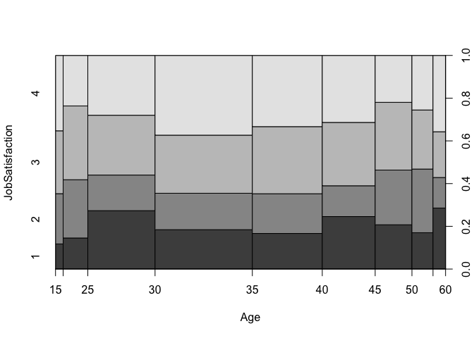<!-- -->

```r
vcd::cd_plot(JobSatisfaction ~Age , data = msds_cs02_ds)
```

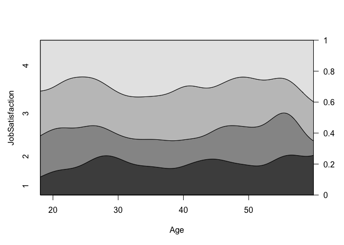<!-- -->

### Monthly Income
<b>Interpretations from Spineplots</b><br>
<ul>
  <li> Proprotion of highly satified is highest for employees with monthly Income range 6000-8000</li>
  <li> Proprotion of highly dissatisfied is highest for employees with monthly Income range 1081-4000 and 15000-18000</li>
</ul>  

Density plot show lows and highs of satisfaction for all incomes.
min(msds_cs02_ds$MonthlyIncome)

```r
spineplot(JobSatisfaction ~ MonthlyIncome, data = msds_cs02_ds)
```

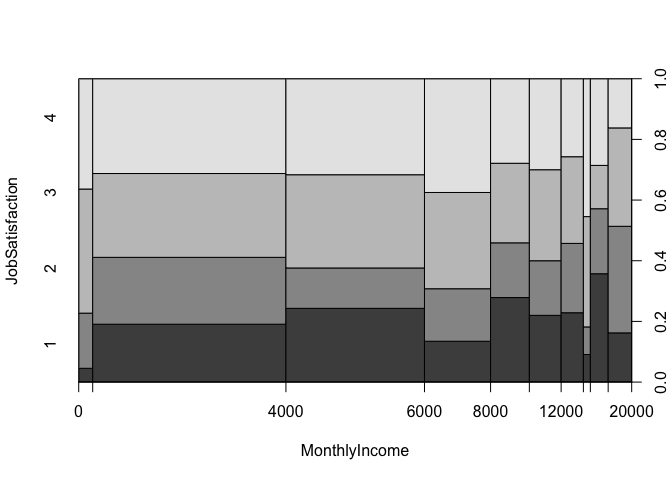<!-- -->

```r
vcd::cd_plot(JobSatisfaction~MonthlyIncome , data = msds_cs02_ds)
```

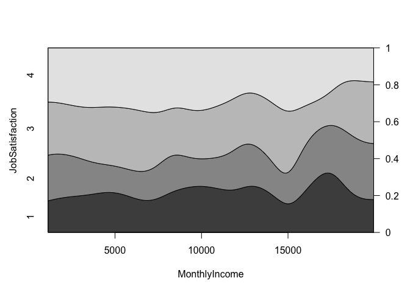<!-- -->


### Distance from Home

As quite obvious employees closer to office are more satisfied compared to those who stay far. Spinogram and density plot shows the same.


```r
spineplot(JobSatisfaction ~ DistanceFromHome, data = msds_cs02_ds)
```

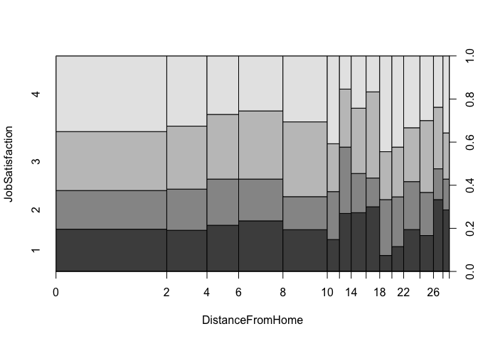<!-- -->

```r
vcd::cd_plot(JobSatisfaction ~DistanceFromHome , data = msds_cs02_ds)
```

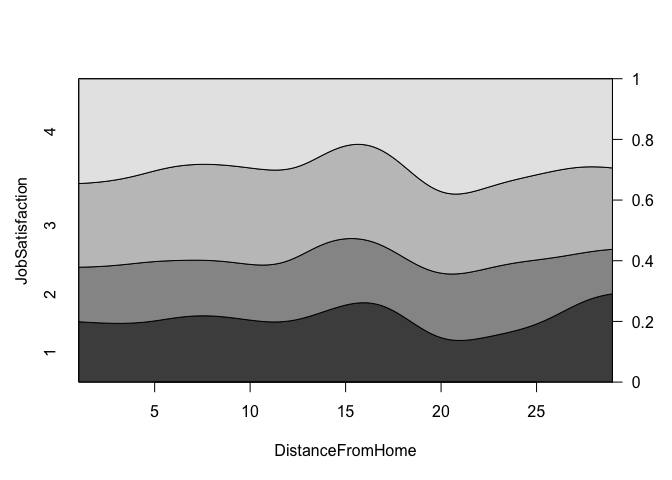<!-- -->


### Other 

Lower the age higher the attrition<br>
Lower monthlyIncome higher the attrition<br>
Higher NumCompaniesWorked higher the attrition<br>
Less exprience higher attrition<br>


```r
opar <- par(mfrow = c(2, 3))
par(opar)
vcd::cd_plot(Attrition ~ Age, data = msds_cs02_ds, main = "Age")
```

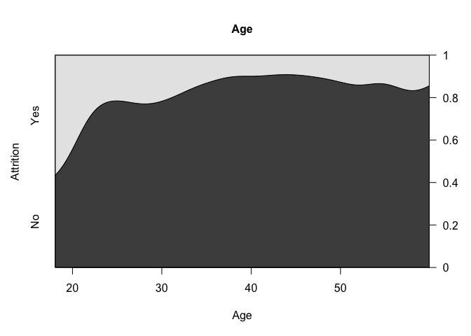<!-- -->

```r
vcd::cd_plot(Attrition ~ DailyRate, data = msds_cs02_ds, main = "DailyRate")
```

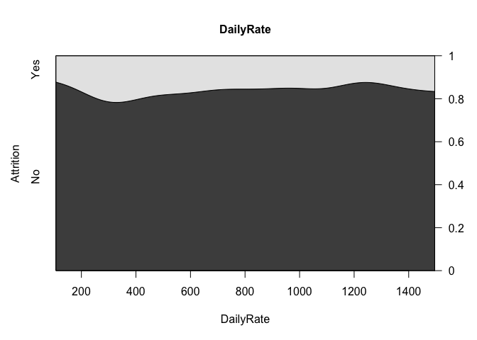<!-- -->

```r
vcd::cd_plot(Attrition ~ HourlyRate, data = msds_cs02_ds, main = "HourlyRate")
```

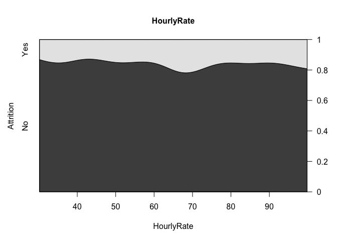<!-- -->

```r
vcd::cd_plot(Attrition ~ MonthlyIncome, data = msds_cs02_ds, main = "MonthlyIncome")
```

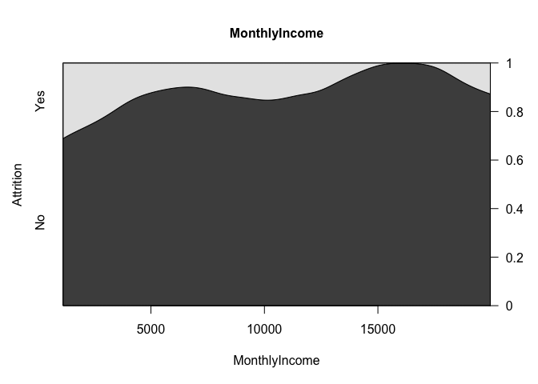<!-- -->

```r
vcd::cd_plot(Attrition ~ NumCompaniesWorked, data = msds_cs02_ds, main = "NumCompaniesWorked")
```

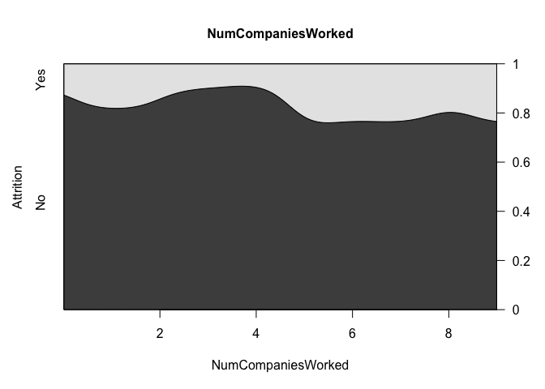<!-- -->

```r
vcd::cd_plot(Attrition ~ PercentSalaryHike, data = msds_cs02_ds, main = "PercentSalaryHike")
```

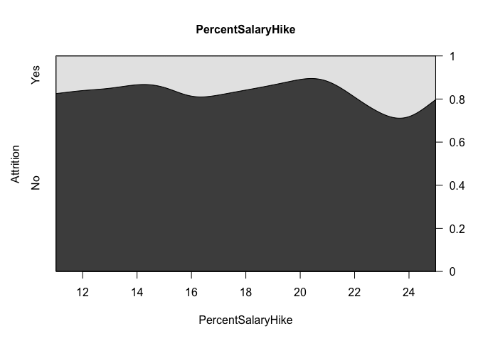<!-- -->

```r
vcd::cd_plot(Attrition ~ TotalWorkingYears, data = msds_cs02_ds, main = "TotalWorkingYears")
```

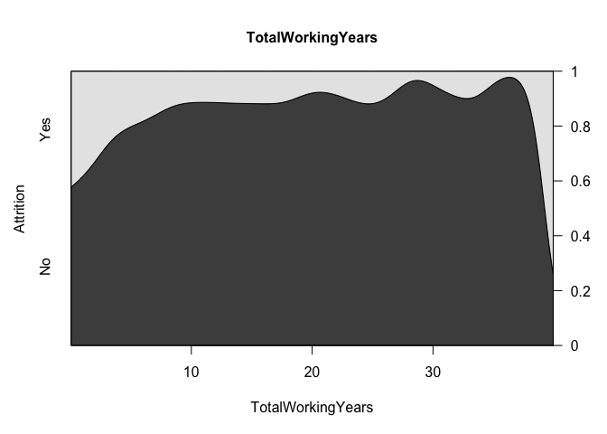<!-- -->

```r
vcd::cd_plot(Attrition ~ TrainingTimesLastYear, data = msds_cs02_ds, main = "TrainingTimesLastYear")
```

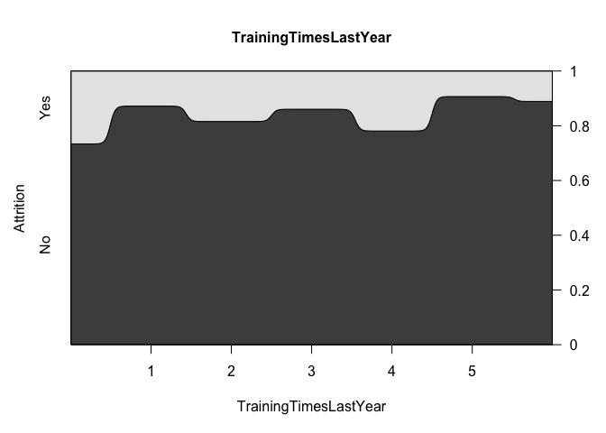<!-- -->

```r
vcd::cd_plot(Attrition ~ YearsAtCompany, data = msds_cs02_ds, main = "YearsAtCompany")
```

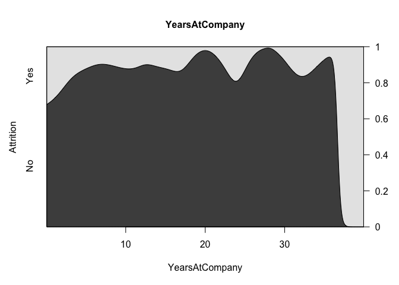<!-- -->

```r
vcd::cd_plot(Attrition ~ YearsInCurrentRole, data = msds_cs02_ds, main = "YearsInCurrentRole")
```

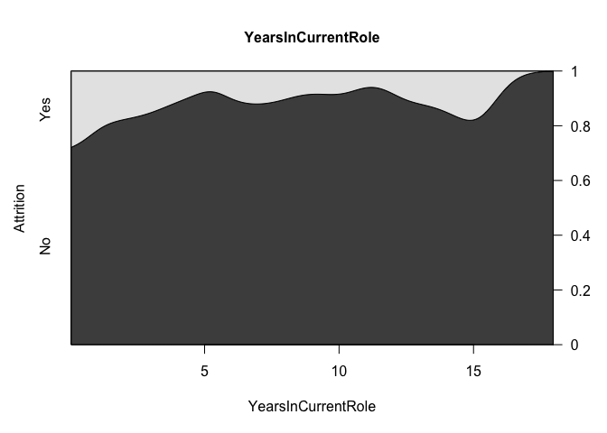<!-- -->

```r
vcd::cd_plot(Attrition ~ YearsSinceLastPromotion, data = msds_cs02_ds, main = "YearsSinceLastPromotion")
```

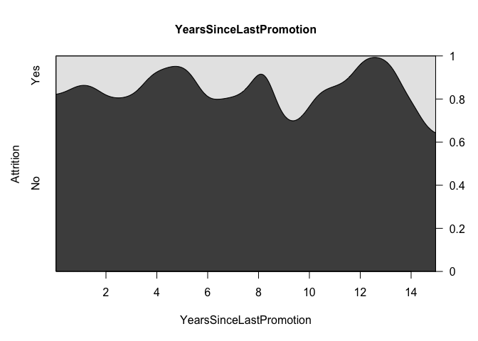<!-- -->

```r
vcd::cd_plot(Attrition ~ YearsWithCurrManager, data = msds_cs02_ds, main = "YearsWithCurrManager")
```

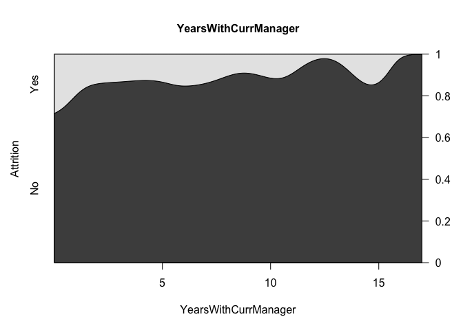<!-- -->

# Hypothesis Tests 

Run hypothesis tests to compare levels of different factors.

Hypothesis : All levels of the factor have same effect on the attrition.<br>
Alternate  : At least one level has different effect on the attrition than other levels.<br>

## Ordinal Qualtitative variables


```r
i=1 
while(i <= length(ord_qual_predictors)) {
   index <- match(ord_qual_predictors[i], names(msds_cs02_ds))
   hypothesis_test <- fisher.test(table(msds_cs02_ds[,c(index,3)]),simulate.p.value=TRUE)
   print(paste("Feature ",ord_qual_predictors[i]," p-value ",round(hypothesis_test$p.value,2)))
   i <- i + 1
}
```

```
## [1] "Feature  Education  p-value  0.64"
## [1] "Feature  EnvironmentSatisfaction  p-value  0.01"
## [1] "Feature  JobInvolvement  p-value  0"
## [1] "Feature  JobLevel  p-value  0"
## [1] "Feature  JobSatisfaction  p-value  0.01"
## [1] "Feature  PerformanceRating  p-value  0.7"
## [1] "Feature  RelationshipSatisfaction  p-value  0.37"
## [1] "Feature  StockOptionLevel  p-value  0"
## [1] "Feature  WorkLifeBalance  p-value  0.01"
```

<font size=4>

Fisher test was performed and from the above p-values returned by fishers' test we conclude that following factors are singificant (p-value < 0.05) i.e. at least one level of the factor is different than others.

<ul>
  <li>EnvironmentSatisfaction</li>
  <li>JobInvolvement</li>
  <li>JobLevel</li>
  <li>JobSatisfaction</li>
  <li>StockOptionLevel</li>
  <li>WorkLifeBalance</li>
</ul>  
So these variables needs to be included for model selections.

</font>

## Nominal Qualtitative variables


```r
i=1 
while(i <=length(nom_qual_predictors)) {
   index <- match(nom_qual_predictors[i], names(msds_cs02_ds))
   hypothesis_test <- fisher.test(table(msds_cs02_ds[,c(index,3)])[,c(2,1)],simulate.p.value=TRUE)
   print(paste("Feature ",nom_qual_predictors[i]," p-value ",round(hypothesis_test$p.value,2)))
   i <- i + 1
}
```

```
## [1] "Feature  BusinessTravel  p-value  0.06"
## [1] "Feature  Department  p-value  0.01"
## [1] "Feature  EducationField  p-value  0.23"
## [1] "Feature  Gender  p-value  0.51"
## [1] "Feature  JobRole  p-value  0"
## [1] "Feature  MaritalStatus  p-value  0"
## [1] "Feature  OverTime  p-value  0"
```
<font size=4>

Fisher test was performed and from the above p-values returned by fishers' test we conclude that following factors are singificant (p-value < 0.05) i.e. at least one level of the factor is different than others.

<ul>
  <li>Department</li>
  <li>JobInvolvement</li>
  <li>JobRole</li>
  <li>MaritalStatus</li>
  <li>OverTime</li>
</ul>  

So these variables needs to be included for model selections
</font>

<font size=4>

<b>Key takeways from EDA</b>

<ul>
  <li>Mean age of attrition is 33</li>
  <li>Major Attrition is at Job Level1 i.e. Research Scientist,Laboratory Technician and Sales Representative</li>
  <li>Males have higher attrition rate compared to Females</li>
  <li>Stock options make people more happy and has lowest contributor to attrition</li>
  <li>Higher the job involvement lower the attrition</li>
</ul>  

<b> 
From the analysis it looks there are few predictors like age, businessTravel,Joblevel,Overtime are highly important as they are major contributor to attrtion. But other fields also seems to be showing some variations to attrition (as per density plots) so we will keep all predictors to build model and will go from there.
</b>

</font>


## Correlation Heatmap

<font size=4>

This heatmap shows multicollinearity exist in the numerical predictors. We have examined the correlated variables and removed manually.

</font>

Age and TotalWorkingYears
YearsAtCompany and YearsAtCurrentRole
YearsAtCompany and YearsWithCurrentManager
YearsWithCurrentManager and YearsAtCurrentRole 


```r
library("corrplot")
```

```
## corrplot 0.84 loaded
```

```r
corr <- round(cor(msds_cs02_ds[,num_predictors[-c(6,8,10,11,12,13)]]), 1)
corr <- round(cor(msds_cs02_ds[,num_predictors]), 1)
corrplot(corr, is.corr=FALSE)
```

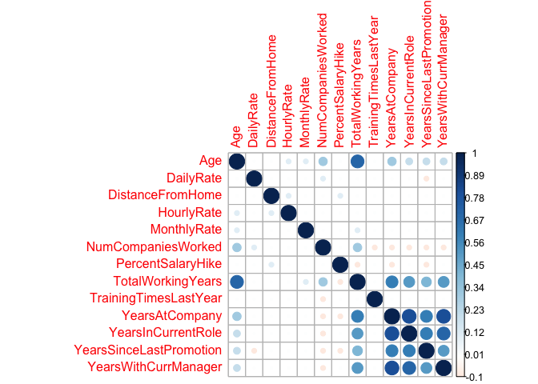<!-- -->

```r
trace1 <- list(
  uid = "b972e66a-6d9c-4cd1-a8fc-c533178a171b", 
  type = "heatmap", 
  x = num_predictors, 
  y = rev(num_predictors), 
  z = corr
)
data <- list(trace1)
layout <- list(
  xaxis = list(
    side = "top", 
    ticks = "outside",
    title = "Correlations Heat Map"
  )
)
p <- plot_ly()
p <- add_trace(p, uid=trace1$uid, type=trace1$type, x=trace1$x, y=trace1$y, z=trace1$z)
p <- layout(p, title=layout$title, xaxis=layout$xaxis)

p
```

<!--html_preserve--><div id="htmlwidget-fda7a4eb768a665c5be7" style="width:672px;height:480px;" class="plotly html-widget"></div>
<script type="application/json" data-for="htmlwidget-fda7a4eb768a665c5be7">{"x":{"visdat":{"d09868d7b6d3":["function () ","plotlyVisDat"]},"cur_data":"d09868d7b6d3","attrs":{"d09868d7b6d3":{"alpha_stroke":1,"sizes":[10,100],"spans":[1,20],"uid":"b972e66a-6d9c-4cd1-a8fc-c533178a171b","type":"heatmap","x":["Age","DailyRate","DistanceFromHome","HourlyRate","MonthlyRate","NumCompaniesWorked","PercentSalaryHike","TotalWorkingYears","TrainingTimesLastYear","YearsAtCompany","YearsInCurrentRole","YearsSinceLastPromotion","YearsWithCurrManager"],"y":["YearsWithCurrManager","YearsSinceLastPromotion","YearsInCurrentRole","YearsAtCompany","TrainingTimesLastYear","TotalWorkingYears","PercentSalaryHike","NumCompaniesWorked","MonthlyRate","HourlyRate","DistanceFromHome","DailyRate","Age"],"z":[[1,0,0,0.1,0.1,0.3,-0,0.7,-0,0.3,0.2,0.2,0.2],[0,1,0,0,-0,0.1,0,-0,-0,-0,-0,-0.1,-0],[0,0,1,0.1,-0,-0,0.1,0,-0,-0,-0,-0,-0],[0.1,0,0.1,1,-0,0,-0,0,0,0,0,0,-0],[0.1,-0,-0,-0,1,0,0,0.1,-0,-0,0,0,-0],[0.3,0.1,-0,0,0,1,-0,0.3,-0.1,-0.1,-0.1,-0.1,-0.1],[-0,0,0.1,-0,0,-0,1,-0.1,0,-0.1,-0,-0.1,-0],[0.7,-0,0,0,0.1,0.3,-0.1,1,-0,0.6,0.5,0.4,0.5],[-0,-0,-0,0,-0,-0.1,0,-0,1,0,-0,-0,0],[0.3,-0,-0,0,-0,-0.1,-0.1,0.6,0,1,0.8,0.6,0.8],[0.2,-0,-0,0,0,-0.1,-0,0.5,-0,0.8,1,0.6,0.7],[0.2,-0.1,-0,0,0,-0.1,-0.1,0.4,-0,0.6,0.6,1,0.5],[0.2,-0,-0,-0,-0,-0.1,-0,0.5,0,0.8,0.7,0.5,1]],"inherit":true}},"layout":{"margin":{"b":40,"l":60,"t":25,"r":10},"xaxis":{"domain":[0,1],"automargin":true,"side":"top","ticks":"outside","title":"Correlations Heat Map"},"yaxis":{"domain":[0,1],"automargin":true,"title":[]},"scene":{"zaxis":{"title":[]}},"hovermode":"closest","showlegend":false,"legend":{"yanchor":"top","y":0.5}},"source":"A","config":{"showSendToCloud":false},"data":[{"colorbar":{"title":"","ticklen":2,"len":0.5,"lenmode":"fraction","y":1,"yanchor":"top"},"colorscale":[["0","rgba(68,1,84,1)"],["0.0416666666666667","rgba(70,19,97,1)"],["0.0833333333333333","rgba(72,32,111,1)"],["0.125","rgba(71,45,122,1)"],["0.166666666666667","rgba(68,58,128,1)"],["0.208333333333333","rgba(64,70,135,1)"],["0.25","rgba(60,82,138,1)"],["0.291666666666667","rgba(56,93,140,1)"],["0.333333333333333","rgba(49,104,142,1)"],["0.375","rgba(46,114,142,1)"],["0.416666666666667","rgba(42,123,142,1)"],["0.458333333333333","rgba(38,133,141,1)"],["0.5","rgba(37,144,140,1)"],["0.541666666666667","rgba(33,154,138,1)"],["0.583333333333333","rgba(39,164,133,1)"],["0.625","rgba(47,174,127,1)"],["0.666666666666667","rgba(53,183,121,1)"],["0.708333333333333","rgba(79,191,110,1)"],["0.75","rgba(98,199,98,1)"],["0.791666666666667","rgba(119,207,85,1)"],["0.833333333333333","rgba(147,214,70,1)"],["0.875","rgba(172,220,52,1)"],["0.916666666666667","rgba(199,225,42,1)"],["0.958333333333333","rgba(226,228,40,1)"],["1","rgba(253,231,37,1)"]],"showscale":true,"uid":"b972e66a-6d9c-4cd1-a8fc-c533178a171b","type":"heatmap","x":["Age","DailyRate","DistanceFromHome","HourlyRate","MonthlyRate","NumCompaniesWorked","PercentSalaryHike","TotalWorkingYears","TrainingTimesLastYear","YearsAtCompany","YearsInCurrentRole","YearsSinceLastPromotion","YearsWithCurrManager"],"y":["YearsWithCurrManager","YearsSinceLastPromotion","YearsInCurrentRole","YearsAtCompany","TrainingTimesLastYear","TotalWorkingYears","PercentSalaryHike","NumCompaniesWorked","MonthlyRate","HourlyRate","DistanceFromHome","DailyRate","Age"],"z":[[1,0,0,0.1,0.1,0.3,-0,0.7,-0,0.3,0.2,0.2,0.2],[0,1,0,0,-0,0.1,0,-0,-0,-0,-0,-0.1,-0],[0,0,1,0.1,-0,-0,0.1,0,-0,-0,-0,-0,-0],[0.1,0,0.1,1,-0,0,-0,0,0,0,0,0,-0],[0.1,-0,-0,-0,1,0,0,0.1,-0,-0,0,0,-0],[0.3,0.1,-0,0,0,1,-0,0.3,-0.1,-0.1,-0.1,-0.1,-0.1],[-0,0,0.1,-0,0,-0,1,-0.1,0,-0.1,-0,-0.1,-0],[0.7,-0,0,0,0.1,0.3,-0.1,1,-0,0.6,0.5,0.4,0.5],[-0,-0,-0,0,-0,-0.1,0,-0,1,0,-0,-0,0],[0.3,-0,-0,0,-0,-0.1,-0.1,0.6,0,1,0.8,0.6,0.8],[0.2,-0,-0,0,0,-0.1,-0,0.5,-0,0.8,1,0.6,0.7],[0.2,-0.1,-0,0,0,-0.1,-0.1,0.4,-0,0.6,0.6,1,0.5],[0.2,-0,-0,-0,-0,-0.1,-0,0.5,0,0.8,0.7,0.5,1]],"xaxis":"x","yaxis":"y","frame":null}],"highlight":{"on":"plotly_click","persistent":false,"dynamic":false,"selectize":false,"opacityDim":0.2,"selected":{"opacity":1},"debounce":0},"shinyEvents":["plotly_hover","plotly_click","plotly_selected","plotly_relayout","plotly_brushed","plotly_brushing","plotly_clickannotation","plotly_doubleclick","plotly_deselect","plotly_afterplot"],"base_url":"https://plot.ly"},"evals":[],"jsHooks":[]}</script><!--/html_preserve-->

# Model Building

## Classification Problem

### Random Forest

Here are top 5 predictors as per random forest <br>
<br>
* Overtime<br>
* MonthlyIncome<br>
* JobRole<br>
* Age<br>
* TotalWorkingYears<br>


```r
library(caret)
```

```
## Loading required package: lattice
```

```r
library(randomForest)
```

```
## randomForest 4.6-14
```

```
## Type rfNews() to see new features/changes/bug fixes.
```

```
## 
## Attaching package: 'randomForest'
```

```
## The following object is masked from 'package:gridExtra':
## 
##     combine
```

```
## The following object is masked from 'package:ggplot2':
## 
##     margin
```

```
## The following object is masked from 'package:dplyr':
## 
##     combine
```

```r
#
# Predictors to be retained from EDA
#

fin_nom_qual_predictors <- nom_qual_predictors[-c(1,3,4)]
fin_ord_qual_predictors <- ord_qual_predictors[-c(1,6,7)]
fin_num_predictors <- num_predictors[-c(6,8,10,11,12,13)] #num_predictors[c(5,2,8,9,7)]
#num_predictors[-c(8,10,12,13)]

msds_cs02_mds <- msds_cs02_ds[, c(fin_nom_qual_predictors,fin_ord_qual_predictors,fin_num_predictors,"MonthlyIncome","Attrition")]

sample_n(msds_cs02_mds, 4)
```

<div data-pagedtable="false">
  <script data-pagedtable-source type="application/json">
{"columns":[{"label":["Department"],"name":[1],"type":["fctr"],"align":["left"]},{"label":["JobRole"],"name":[2],"type":["fctr"],"align":["left"]},{"label":["MaritalStatus"],"name":[3],"type":["fctr"],"align":["left"]},{"label":["OverTime"],"name":[4],"type":["fctr"],"align":["left"]},{"label":["EnvironmentSatisfaction"],"name":[5],"type":["fctr"],"align":["left"]},{"label":["JobInvolvement"],"name":[6],"type":["fctr"],"align":["left"]},{"label":["JobLevel"],"name":[7],"type":["fctr"],"align":["left"]},{"label":["JobSatisfaction"],"name":[8],"type":["fctr"],"align":["left"]},{"label":["StockOptionLevel"],"name":[9],"type":["fctr"],"align":["left"]},{"label":["WorkLifeBalance"],"name":[10],"type":["fctr"],"align":["left"]},{"label":["Age"],"name":[11],"type":["int"],"align":["right"]},{"label":["DailyRate"],"name":[12],"type":["int"],"align":["right"]},{"label":["DistanceFromHome"],"name":[13],"type":["int"],"align":["right"]},{"label":["HourlyRate"],"name":[14],"type":["int"],"align":["right"]},{"label":["MonthlyRate"],"name":[15],"type":["int"],"align":["right"]},{"label":["PercentSalaryHike"],"name":[16],"type":["int"],"align":["right"]},{"label":["TrainingTimesLastYear"],"name":[17],"type":["int"],"align":["right"]},{"label":["MonthlyIncome"],"name":[18],"type":["int"],"align":["right"]},{"label":["Attrition"],"name":[19],"type":["fctr"],"align":["left"]}],"data":[{"1":"Research & Development","2":"Research Director","3":"Married","4":"No","5":"1","6":"3","7":"4","8":"3","9":"2","10":"4","11":"47","12":"359","13":"2","14":"82","15":"26703","16":"19","17":"2","18":"17169","19":"No"},{"1":"Sales","2":"Sales Executive","3":"Divorced","4":"No","5":"4","6":"1","7":"2","8":"4","9":"3","10":"4","11":"32","12":"689","13":"9","14":"35","15":"22812","16":"17","17":"2","18":"4668","19":"No"},{"1":"Research & Development","2":"Research Scientist","3":"Single","4":"No","5":"1","6":"2","7":"1","8":"4","9":"0","10":"3","11":"27","12":"1115","13":"3","14":"54","15":"15174","16":"13","17":"0","18":"2045","19":"No"},{"1":"Research & Development","2":"Laboratory Technician","3":"Married","4":"Yes","5":"3","6":"3","7":"1","8":"4","9":"1","10":"1","11":"33","12":"813","13":"14","14":"58","15":"22149","16":"13","17":"2","18":"2436","19":"Yes"}],"options":{"columns":{"min":{},"max":[10]},"rows":{"min":[10],"max":[10]},"pages":{}}}
  </script>
</div>

```r
# Split the data into training and test set
set.seed(123)
training.samples <- msds_cs02_mds$Attrition %>% createDataPartition(p = 0.8, list = FALSE)
train.data  <- msds_cs02_mds[training.samples, ]
test.data   <- msds_cs02_mds[-training.samples, ]

# Weighting 
model_weights <- ifelse(train.data$Attrition == "No",
                        (1/table(train.data$Attrition)[1]) * 0.5,
                        (1/table(train.data$Attrition)[2]) * 0.5)

# Fit the model on the training set
set.seed(123)
model <- train(
  Attrition ~., data = train.data, method = "rf",
  trControl = trainControl("cv", number = 10,sampling="down"),
  preProcess = c("center","scale"),
#  weights = model_weights,
  importance = TRUE
  )


# Best tuning parameter
model$bestTune
```

<div data-pagedtable="false">
  <script data-pagedtable-source type="application/json">
{"columns":[{"label":[""],"name":["_rn_"],"type":[""],"align":["left"]},{"label":["mtry"],"name":[1],"type":["dbl"],"align":["right"]}],"data":[{"1":"2","_rn_":"1"}],"options":{"columns":{"min":{},"max":[10]},"rows":{"min":[10],"max":[10]},"pages":{}}}
  </script>
</div>

```r
model$finalModel
```

```
## 
## Call:
##  randomForest(x = x, y = y, mtry = param$mtry, importance = TRUE) 
##                Type of random forest: classification
##                      Number of trees: 500
## No. of variables tried at each split: 2
## 
##         OOB estimate of  error rate: 32.14%
## Confusion matrix:
##     No Yes class.error
## No  73  39   0.3482143
## Yes 33  79   0.2946429
```

```r
predicted.classes <- model %>% predict(test.data, type = 'raw')


head(predicted.classes)
```

```
## [1] No  No  Yes No  No  No 
## Levels: No Yes
```

```r
mean(predicted.classes == test.data$Attrition)
```

```
## [1] 0.7241379
```

```r
predicted.classes <- relevel(predicted.classes,ref="Yes")
test.data$Attrition <- relevel(test.data$Attrition ,ref="Yes")
CM <- confusionMatrix(table(predicted.classes, test.data$Attrition))
CM
```

```
## Confusion Matrix and Statistics
## 
##                  
## predicted.classes Yes  No
##               Yes  23  43
##               No    5 103
##                                           
##                Accuracy : 0.7241          
##                  95% CI : (0.6514, 0.7891)
##     No Information Rate : 0.8391          
##     P-Value [Acc > NIR] : 1               
##                                           
##                   Kappa : 0.3403          
##                                           
##  Mcnemar's Test P-Value : 9.27e-08        
##                                           
##             Sensitivity : 0.8214          
##             Specificity : 0.7055          
##          Pos Pred Value : 0.3485          
##          Neg Pred Value : 0.9537          
##              Prevalence : 0.1609          
##          Detection Rate : 0.1322          
##    Detection Prevalence : 0.3793          
##       Balanced Accuracy : 0.7635          
##                                           
##        'Positive' Class : Yes             
## 
```

```r
caret::varImp(model)
```

```
## rf variable importance
## 
##   only 20 most important variables shown (out of 40)
## 
##                                  Importance
## StockOptionLevel1                    100.00
## OverTimeYes                           93.15
## JobLevel4                             92.55
## Age                                   76.12
## JobRoleSales Representative           74.06
## MonthlyIncome                         65.33
## MaritalStatusSingle                   65.04
## DistanceFromHome                      61.12
## DepartmentResearch & Development      54.44
## JobRoleManufacturing Director         53.75
## DepartmentSales                       49.99
## JobLevel2                             45.76
## StockOptionLevel2                     44.41
## JobRoleManager                        43.99
## JobInvolvement4                       40.86
## DailyRate                             40.06
## TrainingTimesLastYear                 39.59
## JobRoleSales Executive                37.17
## JobRoleHuman Resources                34.66
## EnvironmentSatisfaction2              33.29
```

```r
ggplot(caret::varImp(model)) + 
geom_bar(stat = 'identity', fill = 'steelblue', color = 'black') + 
ylab("Feature Importance - Random Forest ")+
scale_y_continuous(limits = c(0, 105), expand = c(0, 0)) +
theme_light()
```

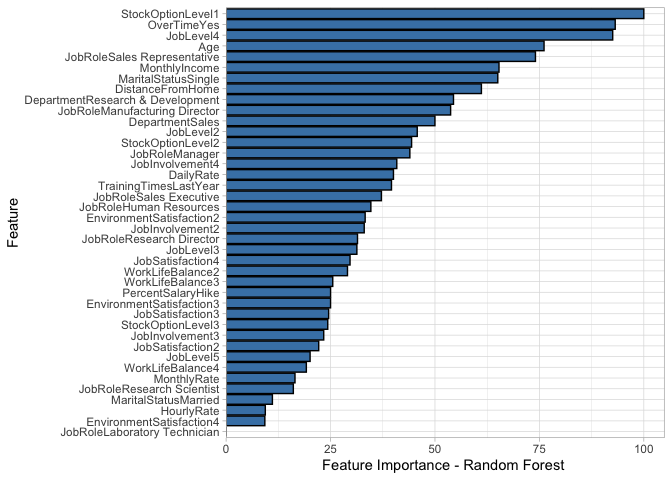<!-- -->

### KNN classifier


```r
#
# This library required for one hot encoding to convert categorical variables into numeric
#
library(dummies)
```

```
## dummies-1.5.6 provided by Decision Patterns
```

```r
#
# Create separate dataframe of 30 predictors 1 target
#
knn_with_target_ds <- msds_cs02_ds[,c(fin_num_predictors,fin_nom_qual_predictors,fin_ord_qual_predictors,"MonthlyIncome","Attrition")] 

knn_hot_encoded_ds <- dummy.data.frame(knn_with_target_ds,names=c(fin_nom_qual_predictors,fin_ord_qual_predictors))
```

```
## Warning in model.matrix.default(~x - 1, model.frame(~x - 1), contrasts = FALSE):
## non-list contrasts argument ignored

## Warning in model.matrix.default(~x - 1, model.frame(~x - 1), contrasts = FALSE):
## non-list contrasts argument ignored

## Warning in model.matrix.default(~x - 1, model.frame(~x - 1), contrasts = FALSE):
## non-list contrasts argument ignored

## Warning in model.matrix.default(~x - 1, model.frame(~x - 1), contrasts = FALSE):
## non-list contrasts argument ignored

## Warning in model.matrix.default(~x - 1, model.frame(~x - 1), contrasts = FALSE):
## non-list contrasts argument ignored

## Warning in model.matrix.default(~x - 1, model.frame(~x - 1), contrasts = FALSE):
## non-list contrasts argument ignored

## Warning in model.matrix.default(~x - 1, model.frame(~x - 1), contrasts = FALSE):
## non-list contrasts argument ignored

## Warning in model.matrix.default(~x - 1, model.frame(~x - 1), contrasts = FALSE):
## non-list contrasts argument ignored

## Warning in model.matrix.default(~x - 1, model.frame(~x - 1), contrasts = FALSE):
## non-list contrasts argument ignored

## Warning in model.matrix.default(~x - 1, model.frame(~x - 1), contrasts = FALSE):
## non-list contrasts argument ignored
```

```r
set.seed(123)
training.samples <- knn_hot_encoded_ds$Attrition %>% createDataPartition(p = 0.8, list = FALSE)
train.data  <- knn_hot_encoded_ds[training.samples, ]
test.data   <- knn_hot_encoded_ds[-training.samples, ]

#res.pca <- PCA(msds_cs02_ds[,fin_num_predictors], graph = FALSE,ncp=20)
#res.pca$eig
#corrplot(res.pca$var$cos2, is.corr=FALSE)
#fviz_contrib(res.pca, choice = "var", axes = 1:7)

# Fit the model on the training set
set.seed(123)
model <- train(
  Attrition ~., data = train.data, method = "knn",
  trControl = trainControl("cv", number = 10,sampling="smote"),
  preProcess = c("center","scale"),
  tuneLength = 20
  )
```

```
## Registered S3 method overwritten by 'xts':
##   method     from
##   as.zoo.xts zoo
```

```
## Registered S3 method overwritten by 'quantmod':
##   method            from
##   as.zoo.data.frame zoo
```

```r
# Plot model accuracy vs different values of k
plot(model)
```

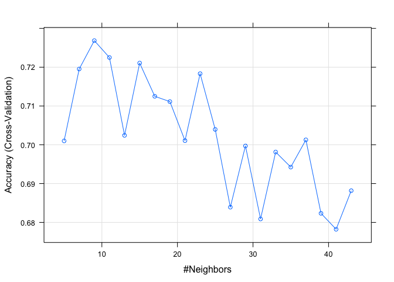<!-- -->

```r
# Print the best tuning parameter k that
# maximizes model accuracy
model$bestTune
```

<div data-pagedtable="false">
  <script data-pagedtable-source type="application/json">
{"columns":[{"label":[""],"name":["_rn_"],"type":[""],"align":["left"]},{"label":["k"],"name":[1],"type":["int"],"align":["right"]}],"data":[{"1":"9","_rn_":"3"}],"options":{"columns":{"min":{},"max":[10]},"rows":{"min":[10],"max":[10]},"pages":{}}}
  </script>
</div>

```r
predicted.classes <- model %>% predict(test.data)
head(predicted.classes)
```

```
## [1] No No No No No No
## Levels: No Yes
```

```r
predicted.classes   <- relevel(predicted.classes,ref="Yes")
test.data$Attrition <- relevel(test.data$Attrition,ref="Yes")

# Compute model accuracy rate
mean(predicted.classes == test.data$Attrition)
```

```
## [1] 0.7471264
```

```r
CM <- confusionMatrix(table(predicted.classes, test.data$Attrition))
CM
```

```
## Confusion Matrix and Statistics
## 
##                  
## predicted.classes Yes  No
##               Yes  19  35
##               No    9 111
##                                           
##                Accuracy : 0.7471          
##                  95% CI : (0.6758, 0.8099)
##     No Information Rate : 0.8391          
##     P-Value [Acc > NIR] : 0.999336        
##                                           
##                   Kappa : 0.3191          
##                                           
##  Mcnemar's Test P-Value : 0.000164        
##                                           
##             Sensitivity : 0.6786          
##             Specificity : 0.7603          
##          Pos Pred Value : 0.3519          
##          Neg Pred Value : 0.9250          
##              Prevalence : 0.1609          
##          Detection Rate : 0.1092          
##    Detection Prevalence : 0.3103          
##       Balanced Accuracy : 0.7194          
##                                           
##        'Positive' Class : Yes             
## 
```

```r
library(ROCR)
```

```
## Loading required package: gplots
```

```
## 
## Attaching package: 'gplots'
```

```
## The following object is masked from 'package:stats':
## 
##     lowess
```

```r
pred <- prediction(as.numeric(if_else(predicted.classes=='Yes',1,0)), as.numeric(if_else(test.data$Attrition=='Yes',1,0)))
nb.prff = performance(pred, "tpr", "fpr")
plot(nb.prff,main="ROC Curve")
```

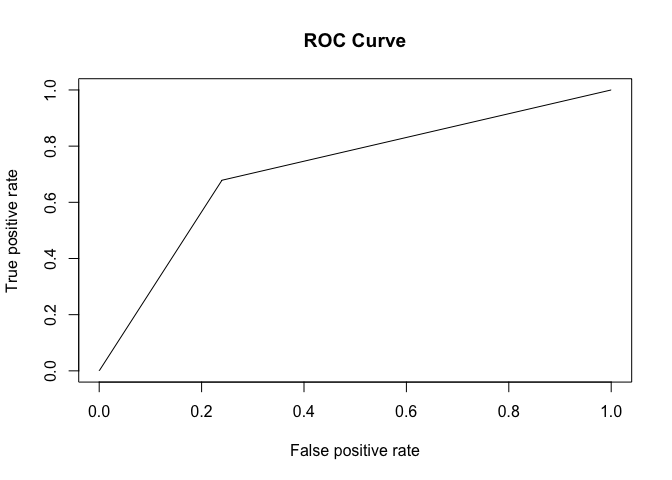<!-- -->

```r
caret::varImp(model)
```

```
## ROC curve variable importance
## 
##   only 20 most important variables shown (out of 50)
## 
##                                  Importance
## OverTimeYes                          100.00
## OverTimeNo                           100.00
## StockOptionLevel0                     88.84
## MonthlyIncome                         87.95
## JobLevel1                             81.27
## StockOptionLevel1                     75.04
## Age                                   66.94
## MaritalStatusSingle                   59.96
## JobLevel2                             54.64
## DepartmentResearch & Development      51.45
## DepartmentSales                       46.74
## JobRoleSales Representative           43.59
## DistanceFromHome                      42.34
## MaritalStatusDivorced                 40.72
## JobInvolvement1                       35.14
## EnvironmentSatisfaction1              34.86
## JobInvolvement3                       34.42
## TrainingTimesLastYear                 33.22
## JobSatisfaction4                      32.72
## JobRoleManufacturing Director         27.39
```

```r
ggplot(caret::varImp(model)) + 
geom_bar(stat = 'identity', fill = 'steelblue', color = 'black') + 
ylab("Feature Importance - Knn Classification ")+
scale_y_continuous(limits = c(0, 105), expand = c(0, 0)) +
theme_light()
```

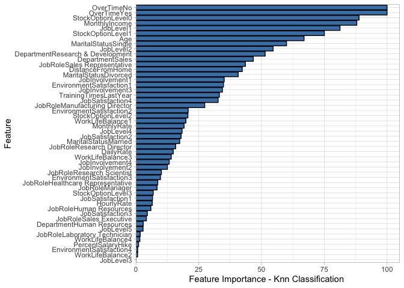<!-- -->

### Naive Bayes Classifier


```r
library(klaR)
```

```
## Loading required package: MASS
```

```
## 
## Attaching package: 'MASS'
```

```
## The following object is masked from 'package:plotly':
## 
##     select
```

```
## The following object is masked from 'package:dplyr':
## 
##     select
```

```r
#
# Create separate dataframe of 30 predictors 1 target
#

nb_with_target_ds <- msds_cs02_ds[,c(fin_num_predictors,fin_nom_qual_predictors,fin_ord_qual_predictors,"Attrition")] 

nb_hot_encoded_ds <- dummy.data.frame(nb_with_target_ds,names=c(fin_nom_qual_predictors,fin_ord_qual_predictors))
# Inspect the data

sample_n(nb_with_target_ds, 3)
```

<div data-pagedtable="false">
  <script data-pagedtable-source type="application/json">
{"columns":[{"label":["Age"],"name":[1],"type":["int"],"align":["right"]},{"label":["DailyRate"],"name":[2],"type":["int"],"align":["right"]},{"label":["DistanceFromHome"],"name":[3],"type":["int"],"align":["right"]},{"label":["HourlyRate"],"name":[4],"type":["int"],"align":["right"]},{"label":["MonthlyRate"],"name":[5],"type":["int"],"align":["right"]},{"label":["PercentSalaryHike"],"name":[6],"type":["int"],"align":["right"]},{"label":["TrainingTimesLastYear"],"name":[7],"type":["int"],"align":["right"]},{"label":["Department"],"name":[8],"type":["fctr"],"align":["left"]},{"label":["JobRole"],"name":[9],"type":["fctr"],"align":["left"]},{"label":["MaritalStatus"],"name":[10],"type":["fctr"],"align":["left"]},{"label":["OverTime"],"name":[11],"type":["fctr"],"align":["left"]},{"label":["EnvironmentSatisfaction"],"name":[12],"type":["fctr"],"align":["left"]},{"label":["JobInvolvement"],"name":[13],"type":["fctr"],"align":["left"]},{"label":["JobLevel"],"name":[14],"type":["fctr"],"align":["left"]},{"label":["JobSatisfaction"],"name":[15],"type":["fctr"],"align":["left"]},{"label":["StockOptionLevel"],"name":[16],"type":["fctr"],"align":["left"]},{"label":["WorkLifeBalance"],"name":[17],"type":["fctr"],"align":["left"]},{"label":["Attrition"],"name":[18],"type":["fctr"],"align":["left"]}],"data":[{"1":"25","2":"1372","3":"18","4":"93","5":"12477","6":"11","7":"3","8":"Sales","9":"Sales Executive","10":"Married","11":"No","12":"1","13":"4","14":"2","15":"3","16":"0","17":"2","18":"No"},{"1":"48","2":"163","3":"2","4":"37","5":"19658","6":"14","7":"2","8":"Sales","9":"Sales Executive","10":"Married","11":"No","12":"2","13":"3","14":"2","15":"4","16":"1","17":"3","18":"No"},{"1":"46","2":"1450","3":"15","4":"52","5":"10849","6":"11","7":"2","8":"Research & Development","9":"Research Director","10":"Married","11":"No","12":"4","13":"3","14":"5","15":"2","16":"1","17":"3","18":"No"}],"options":{"columns":{"min":{},"max":[10]},"rows":{"min":[10],"max":[10]},"pages":{}}}
  </script>
</div>

```r
# Split the data into training and test set

set.seed(123)
training.samples <- nb_hot_encoded_ds$Attrition %>% createDataPartition(p = 0.8, list = FALSE)
train.data  <- nb_hot_encoded_ds[training.samples, ]
test.data   <- nb_hot_encoded_ds[-training.samples, ]


# Fit the model
#model <- NaiveBayes(Attrition ~., data = train.data)
#model
# Make predictions
#predicted.classes <- model %>% predict(test.data)

#pred <- prediction(pred_nb[, 2], test_color$Style)
# Model accuracy
#mean(predicted.classes$class == test.data$Attrition)

set.seed(123)
model <- train(Attrition ~., data = train.data, method = "nb", 
               trControl = trainControl("cv", number = 10,sampling="down")
               )

# Make predictions
predicted.classes <- model %>% predict(test.data)

predicted.classes   <- relevel(predicted.classes,ref="Yes")
test.data$Attrition <- relevel(test.data$Attrition,ref="Yes")

# Compute model accuracy rate
mean(predicted.classes == test.data$Attrition)
```

```
## [1] 0.683908
```

```r
CM <- confusionMatrix(table(predicted.classes, test.data$Attrition))
CM
```

```
## Confusion Matrix and Statistics
## 
##                  
## predicted.classes Yes No
##               Yes  23 50
##               No    5 96
##                                           
##                Accuracy : 0.6839          
##                  95% CI : (0.6092, 0.7522)
##     No Information Rate : 0.8391          
##     P-Value [Acc > NIR] : 1               
##                                           
##                   Kappa : 0.2904          
##                                           
##  Mcnemar's Test P-Value : 2.975e-09       
##                                           
##             Sensitivity : 0.8214          
##             Specificity : 0.6575          
##          Pos Pred Value : 0.3151          
##          Neg Pred Value : 0.9505          
##              Prevalence : 0.1609          
##          Detection Rate : 0.1322          
##    Detection Prevalence : 0.4195          
##       Balanced Accuracy : 0.7395          
##                                           
##        'Positive' Class : Yes             
## 
```

```r
caret::varImp(model)
```

```
## ROC curve variable importance
## 
##   only 20 most important variables shown (out of 49)
## 
##                                  Importance
## OverTimeYes                          100.00
## OverTimeNo                           100.00
## StockOptionLevel0                     88.84
## JobLevel1                             81.27
## StockOptionLevel1                     75.04
## Age                                   66.94
## MaritalStatusSingle                   59.96
## JobLevel2                             54.64
## DepartmentResearch & Development      51.45
## DepartmentSales                       46.74
## JobRoleSales Representative           43.59
## DistanceFromHome                      42.34
## MaritalStatusDivorced                 40.72
## JobInvolvement1                       35.14
## EnvironmentSatisfaction1              34.86
## JobInvolvement3                       34.42
## TrainingTimesLastYear                 33.22
## JobSatisfaction4                      32.72
## JobRoleManufacturing Director         27.39
## EnvironmentSatisfaction2              20.80
```

```r
ggplot(caret::varImp(model)) + 
geom_bar(stat = 'identity', fill = 'steelblue', color = 'black') + 
ylab("Feature Importance -Naive Bayes ")+
scale_y_continuous(limits = c(0, 105), expand = c(0, 0)) +
theme_light()
```

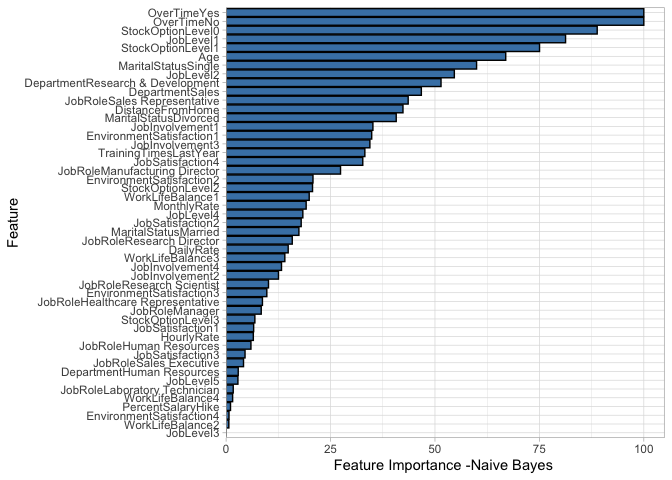<!-- -->


## Regression Problem

### Knn Regression Model


```r
#
# Create separate dataframe of 30 predictors 1 target
#

knn_reg_target_ds <- msds_cs02_ds[,c(fin_num_predictors,fin_nom_qual_predictors,fin_ord_qual_predictors, "MonthlyIncome")] 

kg_hot_encoded_ds <- dummy.data.frame(knn_reg_target_ds,names=c(fin_nom_qual_predictors,fin_ord_qual_predictors))

# Split the data into training and test set
set.seed(123)
training.samples <- kg_hot_encoded_ds$MonthlyIncome %>% createDataPartition(p = 0.8, list = FALSE)

train.data  <- kg_hot_encoded_ds[training.samples, ]
test.data   <- kg_hot_encoded_ds[-training.samples, ]

# Fit the model on the training set
set.seed(123)
model_rg <- train( MonthlyIncome~., data = train.data, method = "knn",
                trControl = trainControl("cv", number = 20),
                preProcess = c("center","scale"),
                tuneLength = 20
              )
# Plot model error RMSE vs different values of k


# Best tuning parameter k that minimize the RMSE
model$bestTune
```

<div data-pagedtable="false">
  <script data-pagedtable-source type="application/json">
{"columns":[{"label":[""],"name":["_rn_"],"type":[""],"align":["left"]},{"label":["fL"],"name":[1],"type":["dbl"],"align":["right"]},{"label":["usekernel"],"name":[2],"type":["lgl"],"align":["right"]},{"label":["adjust"],"name":[3],"type":["dbl"],"align":["right"]}],"data":[{"1":"0","2":"FALSE","3":"1","_rn_":"1"}],"options":{"columns":{"min":{},"max":[10]},"rows":{"min":[10],"max":[10]},"pages":{}}}
  </script>
</div>

```r
# Make predictions on the test data
predictions <- model_rg %>% predict(test.data)

head(predictions)
```

```
## [1]  5265.4 18979.4  6759.0  3015.6  5334.8 15739.2
```

```r
# Compute the prediction error RMSE
RMSE(predictions, test.data$MonthlyIncome)
```

```
## [1] 1565.399
```

```r
plot(predictions, test.data$MonthlyIncome)
```

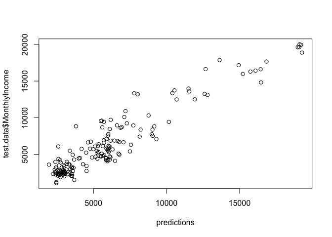<!-- -->

```r
# Model performance metrics
data.frame(
  RMSE = RMSE(predictions, test.data$MonthlyIncome),
  Rsquare = R2(predictions, test.data$MonthlyIncome)
)
```

<div data-pagedtable="false">
  <script data-pagedtable-source type="application/json">
{"columns":[{"label":["RMSE"],"name":[1],"type":["dbl"],"align":["right"]},{"label":["Rsquare"],"name":[2],"type":["dbl"],"align":["right"]}],"data":[{"1":"1565.399","2":"0.8871423"}],"options":{"columns":{"min":{},"max":[10]},"rows":{"min":[10],"max":[10]},"pages":{}}}
  </script>
</div>

```r
p <- plot_ly( x = ~predictions, y = ~test.data$MonthlyIncome,
        marker = list(size = 10,
                       color = 'rgba(255, 182, 193, .9)',
                       line = list(color = 'rgba(152, 0, 0, .8)',
                                   width = 2))) %>%
  layout(title = 'RMSE Plot (kNN)',
         yaxis = list(zeroline = FALSE),
         xaxis = list(zeroline = FALSE))
p
```

```
## No trace type specified:
##   Based on info supplied, a 'scatter' trace seems appropriate.
##   Read more about this trace type -> https://plot.ly/r/reference/#scatter
```

```
## No scatter mode specifed:
##   Setting the mode to markers
##   Read more about this attribute -> https://plot.ly/r/reference/#scatter-mode
```

<!--html_preserve--><div id="htmlwidget-564a9a8f548b363dc53a" style="width:672px;height:480px;" class="plotly html-widget"></div>
<script type="application/json" data-for="htmlwidget-564a9a8f548b363dc53a">{"x":{"visdat":{"d0984f60594c":["function () ","plotlyVisDat"]},"cur_data":"d0984f60594c","attrs":{"d0984f60594c":{"x":{},"y":{},"marker":{"size":10,"color":"rgba(255, 182, 193, .9)","line":{"color":"rgba(152, 0, 0, .8)","width":2}},"alpha_stroke":1,"sizes":[10,100],"spans":[1,20]}},"layout":{"margin":{"b":40,"l":60,"t":25,"r":10},"title":"RMSE Plot (kNN)","yaxis":{"domain":[0,1],"automargin":true,"zeroline":false,"title":"test.data$MonthlyIncome"},"xaxis":{"domain":[0,1],"automargin":true,"zeroline":false,"title":"predictions"},"hovermode":"closest","showlegend":false},"source":"A","config":{"showSendToCloud":false},"data":[{"x":[5265.4,18979.4,6759,3015.6,5334.8,15739.2,4626.4,2453.6,4817.2,3542.2,2530.2,9301,3681.6,2903.6,6117.2,6028.8,6434.2,10542.8,6930.4,5723.8,16438.2,3630.4,2537.6,2981.8,6710,6607.4,2950.4,3535.8,8162,1954,5860,6165.6,2999.2,6298.4,5893.6,8221.4,5602.6,9036,15223.6,5992.4,8026.6,2375.8,6106.8,19266.8,2408.6,2782.6,5646.6,2829.2,19204.8,5982.4,2671.6,2773.2,5502.2,5095.8,2963,2768.4,5355.6,3385.2,7489.8,5639,3027.6,4066,6768.2,6011.2,6109.6,6473,7781.6,10396,5707.2,5955.6,2833.8,19101.4,3988.4,5226.8,5569.2,11557.4,2676.8,13629.8,7559.8,6094.4,3285,12671.6,7280.8,3413.8,2601.6,4523.8,5540,3531.6,2806.6,5866.2,12607,5884.8,4187.6,8768.8,2461,2434.4,14934.8,6038.2,3013.4,2772.4,2868.6,9049.6,9156.6,3475.4,2427.8,5286.8,2652,3144.2,5561.8,3356.4,2923.8,6179.4,11502.4,2667.2,6655.4,4519.4,3302.4,7189.8,6027.8,16468,5948.4,3178.2,2344,3521,3799.6,2898.4,16838.8,6854.4,3592,2739.4,3214,11930,5489.4,10687.6,5998,4496,2739.4,5709.8,2980.2,2910.2,2588.4,4988.2,2554.6,5716.8,4279.6,4899.8,10158.4,6018.6,2389.4,6158.2,3670.4,2624.6,2747.6,3415.8,2229.2,3162.2,7047.6,5304.8,4765.4,5141.8,3527,5839.2,16089.2,12803,3576.8,2575.6,8987.8,7106.2,2983.6,19079.6,2718.8,7725.6],"y":[4403,19626,6694,2706,5332,16291,6632,1223,6735,2024,2289,7094,1514,2210,8463,5916,6883,13726,8726,4907,16606,3180,2819,2439,5093,8966,2451,2319,7428,3597,4233,6870,2008,5677,7104,8380,8686,8376,15972,4221,13194,2559,4286,18880,2269,2438,4779,2157,19943,7547,2844,2661,9547,6074,3537,2380,6385,5484,5405,6120,2332,4508,4968,7756,4728,4115,13341,13348,6929,4069,3210,19999,4444,5473,5087,13582,2174,17861,6306,6091,2559,16627,9241,3022,4382,3420,4735,2066,2644,4450,13245,5772,5747,10312,1081,2655,17169,5343,2610,2413,2587,7525,8823,2089,3202,5155,3491,2929,9602,3622,2436,9714,13973,2693,6834,2741,3629,10903,6142,14814,5605,3986,2926,3280,8837,2835,17665,8628,2725,1904,2305,12504,4741,12490,5505,5228,2329,9439,2713,2622,6077,5714,2148,6578,3660,4581,9434,5768,3968,4601,4285,2296,3907,2500,2323,3708,6651,6151,5769,4682,3140,4539,16422,13116,4941,2096,7756,10096,3348,19627,4193,8943],"marker":{"color":"rgba(255, 182, 193, .9)","size":10,"line":{"color":"rgba(152, 0, 0, .8)","width":2}},"type":"scatter","mode":"markers","error_y":{"color":"rgba(31,119,180,1)"},"error_x":{"color":"rgba(31,119,180,1)"},"line":{"color":"rgba(31,119,180,1)"},"xaxis":"x","yaxis":"y","frame":null}],"highlight":{"on":"plotly_click","persistent":false,"dynamic":false,"selectize":false,"opacityDim":0.2,"selected":{"opacity":1},"debounce":0},"shinyEvents":["plotly_hover","plotly_click","plotly_selected","plotly_relayout","plotly_brushed","plotly_brushing","plotly_clickannotation","plotly_doubleclick","plotly_deselect","plotly_afterplot"],"base_url":"https://plot.ly"},"evals":[],"jsHooks":[]}</script><!--/html_preserve-->


### Penalized Regression Model (LASSO)


```r
library(glmnet)
```

```
## Loading required package: Matrix
```

```
## Loading required package: foreach
```

```
## Loaded glmnet 2.0-18
```

```r
#
# Create separate dataframe of 30 predictors 1 target
#
mlp_reg_target_ds <- msds_cs02_ds[,c(fin_num_predictors,nom_qual_predictors,fin_ord_qual_predictors, "MonthlyIncome")] 

#mlp_hot_encoded_ds <- dummy.data.frame(mlp_reg_target_ds,names=c(fin_nom_qual_predictors,fin_ord_qual_predictors))

# Split the data into training and test set
set.seed(123)
training.samples <- mlp_reg_target_ds$MonthlyIncome %>% createDataPartition(p = 0.8, list = FALSE)
train.data  <- mlp_reg_target_ds[training.samples, ]
test.data <- mlp_reg_target_ds[-training.samples, ]


# Predictor variables
x <- model.matrix(MonthlyIncome~., train.data)[,-1]
# Outcome variable
y <- train.data$MonthlyIncome

# Find the best lambda using cross-validation
set.seed(123) 
cv <- cv.glmnet(x, y, alpha = 1)
# Display the best lambda value
cv$lambda.min
```

```
## [1] 38.74357
```

```r
# Fit the final model on the training data
model <- glmnet(x, y, alpha = 1, lambda = cv$lambda.min)
# Dsiplay regression coefficients
coef(model)
```

```
## 48 x 1 sparse Matrix of class "dgCMatrix"
##                                             s0
## (Intercept)                       3196.4231798
## Age                                 16.5648076
## DailyRate                            0.1024272
## DistanceFromHome                     .        
## HourlyRate                           .        
## MonthlyRate                          .        
## PercentSalaryHike                    .        
## TrainingTimesLastYear                .        
## BusinessTravelTravel_Frequently      .        
## BusinessTravelTravel_Rarely        125.3324523
## DepartmentResearch & Development     .        
## DepartmentSales                      .        
## EducationFieldLife Sciences          .        
## EducationFieldMarketing              .        
## EducationFieldMedical                .        
## EducationFieldOther                  .        
## EducationFieldTechnical Degree     -16.9864853
## GenderMale                           .        
## JobRoleHuman Resources           -1058.9637181
## JobRoleLaboratory Technician     -1134.9735365
## JobRoleManager                    3224.7908177
## JobRoleManufacturing Director       41.7020537
## JobRoleResearch Director          3330.2678378
## JobRoleResearch Scientist         -898.9129480
## JobRoleSales Executive               .        
## JobRoleSales Representative      -1163.9441813
## MaritalStatusMarried                 .        
## MaritalStatusSingle                -10.5105598
## OverTimeYes                          .        
## EnvironmentSatisfaction2             .        
## EnvironmentSatisfaction3             .        
## EnvironmentSatisfaction4             .        
## JobInvolvement2                      .        
## JobInvolvement3                      .        
## JobInvolvement4                     14.7333612
## JobLevel2                         1679.9360048
## JobLevel3                         5162.7923389
## JobLevel4                         8752.6620728
## JobLevel5                        11517.9229502
## JobSatisfaction2                     .        
## JobSatisfaction3                     .        
## JobSatisfaction4                    28.3873359
## StockOptionLevel1                    5.9321437
## StockOptionLevel2                    .        
## StockOptionLevel3                   -7.9468728
## WorkLifeBalance2                     .        
## WorkLifeBalance3                     3.9392092
## WorkLifeBalance4                     .
```

```r
summary(model$beta)
```

<div data-pagedtable="false">
  <script data-pagedtable-source type="application/json">
{"columns":[{"label":["i"],"name":[1],"type":["int"],"align":["right"]},{"label":["j"],"name":[2],"type":["int"],"align":["right"]},{"label":["x"],"name":[3],"type":["dbl"],"align":["right"]}],"data":[{"1":"1","2":"1","3":"16.5648076"},{"1":"2","2":"1","3":"0.1024272"},{"1":"9","2":"1","3":"125.3324523"},{"1":"16","2":"1","3":"-16.9864853"},{"1":"18","2":"1","3":"-1058.9637181"},{"1":"19","2":"1","3":"-1134.9735365"},{"1":"20","2":"1","3":"3224.7908177"},{"1":"21","2":"1","3":"41.7020537"},{"1":"22","2":"1","3":"3330.2678378"},{"1":"23","2":"1","3":"-898.9129480"},{"1":"25","2":"1","3":"-1163.9441813"},{"1":"27","2":"1","3":"-10.5105598"},{"1":"34","2":"1","3":"14.7333612"},{"1":"35","2":"1","3":"1679.9360048"},{"1":"36","2":"1","3":"5162.7923389"},{"1":"37","2":"1","3":"8752.6620728"},{"1":"38","2":"1","3":"11517.9229502"},{"1":"41","2":"1","3":"28.3873359"},{"1":"42","2":"1","3":"5.9321437"},{"1":"44","2":"1","3":"-7.9468728"},{"1":"46","2":"1","3":"3.9392092"}],"options":{"columns":{"min":{},"max":[10]},"rows":{"min":[10],"max":[10]},"pages":{}}}
  </script>
</div>

```r
# Make predictions on the test data
x.test <- model.matrix(MonthlyIncome ~., test.data)[,-1]
predictions <- model %>% predict(x.test) %>% as.vector()
# Model performance metrics
data.frame(
  RMSE = RMSE(predictions, test.data$MonthlyIncome),
  Rsquare = R2(predictions, test.data$MonthlyIncome)
)
```

<div data-pagedtable="false">
  <script data-pagedtable-source type="application/json">
{"columns":[{"label":["RMSE"],"name":[1],"type":["dbl"],"align":["right"]},{"label":["Rsquare"],"name":[2],"type":["dbl"],"align":["right"]}],"data":[{"1":"1084.64","2":"0.9433065"}],"options":{"columns":{"min":{},"max":[10]},"rows":{"min":[10],"max":[10]},"pages":{}}}
  </script>
</div>

```r
p <- plot_ly( x = ~predictions, y = ~test.data$MonthlyIncome,
        marker = list(size = 10,
                       color = 'rgba(255, 182, 193, .9)',
                       line = list(color = 'rgba(152, 0, 0, .8)',
                                   width = 2))) %>%
  layout(title = 'RMSE Plot(LASSO)',
         yaxis = list(zeroline = FALSE),
         xaxis = list(zeroline = FALSE))
p
```

```
## No trace type specified:
##   Based on info supplied, a 'scatter' trace seems appropriate.
##   Read more about this trace type -> https://plot.ly/r/reference/#scatter
```

```
## No scatter mode specifed:
##   Setting the mode to markers
##   Read more about this attribute -> https://plot.ly/r/reference/#scatter-mode
```

<!--html_preserve--><div id="htmlwidget-b3f303b381a7964f07ab" style="width:672px;height:480px;" class="plotly html-widget"></div>
<script type="application/json" data-for="htmlwidget-b3f303b381a7964f07ab">{"x":{"visdat":{"d0982098b0b7":["function () ","plotlyVisDat"]},"cur_data":"d0982098b0b7","attrs":{"d0982098b0b7":{"x":{},"y":{},"marker":{"size":10,"color":"rgba(255, 182, 193, .9)","line":{"color":"rgba(152, 0, 0, .8)","width":2}},"alpha_stroke":1,"sizes":[10,100],"spans":[1,20]}},"layout":{"margin":{"b":40,"l":60,"t":25,"r":10},"title":"RMSE Plot(LASSO)","yaxis":{"domain":[0,1],"automargin":true,"zeroline":false,"title":"test.data$MonthlyIncome"},"xaxis":{"domain":[0,1],"automargin":true,"zeroline":false,"title":"predictions"},"hovermode":"closest","showlegend":false},"source":"A","config":{"showSendToCloud":false},"data":[{"x":[5578.06894047742,18956.0029284407,5670.61919160186,2668.21237611638,5456.53231009644,16176.4165705458,4657.3215004888,2851.90995349657,5623.93394037338,2821.46936876364,2926.00851606991,9101.12260476864,2731.73951769478,2691.05797655475,5547.63684539219,5684.05068304576,5773.35855960612,13188.4948324198,8901.70659993266,5766.3940304675,16090.4752146481,2579.81654765189,2915.14682682816,2983.54267454948,5587.53290176596,5716.85564464326,3159.49979153062,2759.48675666294,9241.04776608919,2626.62389679701,5655.01378665015,5730.85650325233,2809.85000859246,5719.6329657019,5676.8209597086,9104.7601656553,5720.93498870627,9277.24938005781,16213.9534847212,5352.46505975909,12767.3901716471,3223.33779983253,5657.05745531537,18790.9194756388,2721.72460903687,3034.41892438475,5590.15032128895,2677.93839703815,19058.5262149665,5610.35753274817,2957.27108046532,2926.11124037294,5590.75936247622,4365.41484652874,3474.38955003001,3129.70048091284,5805.19048164335,4838.68076039191,6109.77039865549,5829.54239951265,2716.73648844148,4602.22082260164,5615.45507769847,5520.73942205717,5796.25588862684,5630.75393663027,12726.0626857677,12659.458228621,5569.59615494391,5688.24988428274,2965.07920538518,19007.3073533456,4318.41677664199,5801.74122954308,5772.65709326635,12573.6988091911,2434.21707766796,16270.0157265287,5878.23948892306,5594.62332272503,3129.66010623753,16231.3898112134,9251.16189200199,3081.47006761379,2967.30693597792,3266.35027836291,4757.08218985518,3484.95017634313,2890.52955903888,6051.0321371842,12580.000597827,5784.19564610016,4648.26022438955,9494.68308751153,2769.4261492038,2904.04742249361,16220.0028604811,5704.75039458408,2489.88906909519,2656.72835078961,3255.24770069932,9259.72264522492,9153.7437757301,3182.63292584045,2680.12356837602,5753.17338770321,4443.08584838277,3087.81832209607,5677.67603340102,3050.32133718345,3279.72719941393,5584.30333814947,13050.4106224274,2934.7440199036,5458.63297570989,4656.32649055887,2942.85717775709,9161.80208588571,5531.12442400078,16400.6472896113,5688.74059450167,4582.74929697861,2503.77586294857,3041.23723711157,8144.5500636017,2915.81172689688,16052.8401463745,9180.59086128469,2938.23516089109,2378.34434520748,2649.46682419439,12564.6681073508,5367.71942106767,12810.0865380395,5620.8082908632,5718.8388971896,2687.0942732729,9512.00552566973,2966.0447398214,2988.47734062928,4541.75270877913,5708.29316106318,2791.64913539034,5595.77518345236,4643.86284348377,5564.140153476,9198.38916398563,5717.07334304599,2992.90451481816,5710.25785644979,4817.03904087373,2599.19284530979,2628.21876308751,3001.08335399288,2464.35764477246,2822.75458591246,5955.44151631185,5575.16630564556,4709.52668920068,5492.9076235494,2965.34927193301,5546.31153856923,15926.3257666319,12637.583112631,5038.20354186183,2853.69794653453,9202.30845117524,9185.1553487566,2947.78918817992,19008.2978058828,4356.19752987986,9006.03485824768],"y":[4403,19626,6694,2706,5332,16291,6632,1223,6735,2024,2289,7094,1514,2210,8463,5916,6883,13726,8726,4907,16606,3180,2819,2439,5093,8966,2451,2319,7428,3597,4233,6870,2008,5677,7104,8380,8686,8376,15972,4221,13194,2559,4286,18880,2269,2438,4779,2157,19943,7547,2844,2661,9547,6074,3537,2380,6385,5484,5405,6120,2332,4508,4968,7756,4728,4115,13341,13348,6929,4069,3210,19999,4444,5473,5087,13582,2174,17861,6306,6091,2559,16627,9241,3022,4382,3420,4735,2066,2644,4450,13245,5772,5747,10312,1081,2655,17169,5343,2610,2413,2587,7525,8823,2089,3202,5155,3491,2929,9602,3622,2436,9714,13973,2693,6834,2741,3629,10903,6142,14814,5605,3986,2926,3280,8837,2835,17665,8628,2725,1904,2305,12504,4741,12490,5505,5228,2329,9439,2713,2622,6077,5714,2148,6578,3660,4581,9434,5768,3968,4601,4285,2296,3907,2500,2323,3708,6651,6151,5769,4682,3140,4539,16422,13116,4941,2096,7756,10096,3348,19627,4193,8943],"marker":{"color":"rgba(255, 182, 193, .9)","size":10,"line":{"color":"rgba(152, 0, 0, .8)","width":2}},"type":"scatter","mode":"markers","error_y":{"color":"rgba(31,119,180,1)"},"error_x":{"color":"rgba(31,119,180,1)"},"line":{"color":"rgba(31,119,180,1)"},"xaxis":"x","yaxis":"y","frame":null}],"highlight":{"on":"plotly_click","persistent":false,"dynamic":false,"selectize":false,"opacityDim":0.2,"selected":{"opacity":1},"debounce":0},"shinyEvents":["plotly_hover","plotly_click","plotly_selected","plotly_relayout","plotly_brushed","plotly_brushing","plotly_clickannotation","plotly_doubleclick","plotly_deselect","plotly_afterplot"],"base_url":"https://plot.ly"},"evals":[],"jsHooks":[]}</script><!--/html_preserve-->

# Conclusion

<font size=5>
<b>Top 6 factors determined by Random Forest model. Three of which are matching to EDA</b>

<ul>
  <li>Stock Options</li>
  <li>Overtime</li>
  <li>Job Level</li>
  <li>Age</li>
  <li>Job Role</li>
  <li>MonthlyIncome</li>
</ul>  

23 Research Scientist, Most of the lab technicians, 33 Sales Representative and Sales executive and few were both overloaded and without any stock options.<br>

Our model has captured that accurately.

</font>

